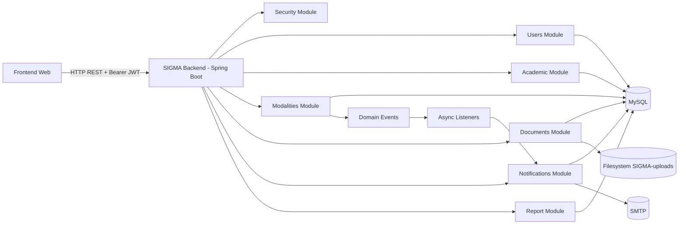
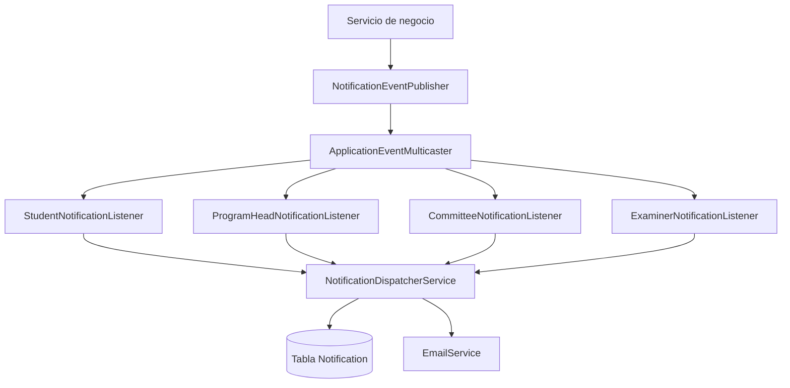

# SIGMA - Documentacion Tecnica Final

## Portada

- **Proyecto:** SIGMA - Sistema Interno de Gestion de Modalidades Academicas
- **Tipo de documento:** Documentacion tecnica integral (lista para sustentacion)
- **Version del documento:** 1.0
- **Fecha de emision:** 2026-03-21
- **Institucion:** Universidad Surcolombiana
- **Alcance tecnico:** Backend institucional + contrato de integracion con frontend

---

## Control documental

| Version | Fecha | Autor | Cambios |
|---|---|---|---|
| 1.0 | 2026-03-21 | Equipo SIGMA | Consolidacion tecnica integral para presentacion final |

---

## Tabla de contenido

1. Introduccion tecnica
2. Objetivo, alcance y limites
3. Metodologia de elaboracion de esta documentacion
4. Tecnologias y stack del proyecto
5. Arquitectura general del sistema
6. Casos de uso tecnicos
7. Diseno de modulos principales
8. Modelo de datos y diagrama de clases
9. Estructura de paquetes (backend y frontend)
10. API REST y contratos
11. Seguridad
12. Manejo de archivos
13. Eventos y notificaciones
14. Reporteria institucional
15. Manual de usuario (por rol)
16. Swagger / OpenAPI
17. Pruebas y validacion
18. Despliegue y operacion
19. Riesgos, limitaciones y mejora continua
20. Anexos

---

## 1. Introduccion tecnica

SIGMA es una plataforma institucional orientada a gestionar de forma integral el ciclo de modalidades academicas de grado. El sistema soporta flujos de trabajo con multiples actores (estudiante, jefatura de programa, comite curricular, director, jurados y administracion), manteniendo trazabilidad sobre documentos, decisiones, sustentaciones y resultados.

El backend analizado esta implementado como aplicacion monolitica modular en Spring Boot, con seguridad JWT, persistencia en MySQL, almacenamiento de archivos en filesystem y un subsistema de eventos para notificaciones asincronas.

---

## 2. Objetivo, alcance y limites

## 2.1 Objetivo técnico general

Implementar SIGMA como una plataforma institucional integral (backend, integración con frontend y procesos operativos) que automatiza y digitaliza el ciclo completo de modalidades académicas de grado, garantizando trazabilidad documental, seguridad, eficiencia operativa y soporte a la toma de decisiones mediante notificaciones y reportes.

### 2.1.1 Objetivos específicos por dominio

| Dominio | Objetivo técnico |
|---|---|
| Usuarios y seguridad | Gestionar identidades, roles y permisos, mantener autenticación JWT stateless y blacklist de tokens inválidos. |
| Configuración académica | Mantener catálogos de facultades, programas y modalidades; permitir ingestión automática de historiales académicos en PDF y actualización de perfiles. |
| Modalidades | Orquestar apertura, revisión, aprobación, cancelación, sustentación y cierre de modalidades individuales y grupales, con trazabilidad y notificación a todos los actores. |
| Documentos | Validar, versionar y almacenar documentos requeridos, con historial de revisiones, solicitudes de edición y control de acceso. |
| Notificaciones | Publicar eventos de dominio y distribuir alertas in-app y por correo a estudiantes, jurados y equipos administrativos. |
| Reportería | Generar reportes JSON/PDF con información operativa, calendarios de sustentación y métricas de avance para la gestión institucional. |
| Operación | Automatizar tareas programadas (correcciones, deadlines), administrar almacenamiento de archivos y garantizar la continuidad operativa. |

## 2.2 Alcance del sistema y de la documentación

Esta documentación cubre el sistema SIGMA como solución integral:

- El backend institucional ubicado en `src/main/java/com/SIGMA/USCO` y sus configuraciones (`application*.properties`).
- El contrato REST y las decisiones de seguridad que permiten la integración con un frontend institucional (URL definida en `frontend.url`).
- El subsistema de eventos, notificaciones asincrónicas, almacenamiento documental y reportes.
- Procesos operativos (scheduler, almacenes de archivos y conexión con SMTP).
- Referencias a la arquitectura y estructura esperada del frontend, aunque el código fuente no está incluido en este repositorio.

Se detallan los flujos de negocio, los módulos, el modelo de datos, los casos de uso técnicos, la seguridad, la integración y las garantías operativas que el sistema brinda a cada actor institucional.

## 2.3 Límites y restricciones explícitas

1. **Frontend no incluido:** El código fuente del frontend no está presente en este repositorio; la interfaz se describe como arquitectura referencial y contrato REST para integración. El documento aclara esta limitación pero provee guías y estructura esperada para el equipo frontend.
2. **Swagger/OpenAPI no habilitado actualmente:** No existe la dependencia `springdoc-openapi` en `pom.xml`, por lo que no está expuesto `/swagger-ui`. Se documenta el plan de adopción en la sección dedicada.
3. **Secretos en propiedades de desarrollo:** `application-dev.properties` contiene credenciales en texto plano. Antes de cualquier despliegue productivo se deben externalizar mediante variables de entorno o un vault y rotar las credenciales.
4. **Cobertura de pruebas parcial:** Hay tres tests principales (`SigmaApplicationTests`, `AcademicHistoryPdfParserServiceTest`, `PdfDiagnosticTest`). Falta ampliar la cobertura hacia flujos completos y pruebas de integración con seguridad.
5. **Monolito sin escalabilidad horizontal activa:** Actualmente el sistema se ejecuta en un único proceso; no existe cache distribuido ni broker externo. Esta decisión es consciente y se documenta para futuras iteraciones.

## 2.4 Exclusiones relevantes

| Tema | Motivo |
|---|---|
| Infraestructura (Docker, Kubernetes, cloud) | Corresponde a infraestructura y se documenta solo el despliegue local. |
| Integración con sistemas legacy (SIS USCO) | Está planificada para etapas futuras. |
| Frontend real | Se trabaja con referencias y contratos abiertos. |
| Auditoría forense avanzada | No requerida en esta fase, pero se deja abierta como mejora. |

## 2.5 Criterios de éxito del documento

1. Un desarrollador nuevo comprende arquitectura y flujos tras leer las secciones 1-5.
2. Un integrador puede consumir la API siguiendo las secciones 6, 10 y 16.
3. Un responsable operativo encuentra pautas de despliegue y riesgos en las secciones finales.
4. Un equipo académico valida los casos de uso y el alcance global del sistema.

---

## 3. Metodología aplicada al desarrollo del sistema

### 3.1 Enfoque ágil para la construcción de SIGMA

El desarrollo de SIGMA, tanto backend como frontend institucional y los procesos operativos asociados, se realizó bajo una metodología ágil, combinando prácticas de Scrum y Lean. El objetivo fue maximizar la entrega de valor, la adaptabilidad y la calidad técnica, asegurando la integración continua entre los equipos de backend y frontend.

- **Sprints cortos (1-2 semanas):** Cada iteración entregó incrementos funcionales probados (autenticación, flujo documental, notificaciones, reportes) y avances sincronizados en el frontend.
- **Backlog priorizado:** El Product Backlog se ordenó según impacto institucional, priorizando casos de uso críticos y funcionalidades transversales.
- **Eventos regulares:** Se realizaron reuniones diarias (stand-up), revisiones de sprint (demo) y retrospectivas para ajustar criterios de calidad, pruebas y documentación.
- **Retroalimentación temprana:** Prototipos y flujos fueron validados con stakeholders (estudiantes, jefaturas, comités) antes de cerrar cada sprint.
- **Integración continua:** Cada cambio relevante se construyó y probó mediante `mvnw clean package` y despliegues locales; el frontend se mantuvo sincronizado con los contratos REST documentados.

### 3.2 Fases iterativas del proyecto

1. **Descubrimiento y arquitectura inicial:** Levantamiento de requerimientos institucionales, definición de módulos principales (usuarios, modalidades, documentos, notificaciones, reportes) y acuerdo sobre la arquitectura monolítica modular.
2. **Desarrollo e integración backend:** Implementación de controladores, servicios, repositorios, seguridad JWT y manejo de archivos. Paralelamente, definición de fixtures de datos y pruebas unitarias/componentes críticos.
3. **Construcción del frontend:** El equipo frontend desarrolló flujos principales (login, carga documental, reportes) siguiendo los contratos REST y pruebas del backend; se mantuvo sincronización constante para garantizar compatibilidad.
4. **Automatización y eventos:** Se añadieron publisher/listener de notificaciones, scheduler de correcciones y exportación a PDF; cada avance se adaptó con pruebas de integración y monitoreo de logs.
5. **Documentación continua:** La documentación técnica (diagramas, casos de uso, manuales) se alimentó de forma iterativa para reflejar el estado real del sistema.

### 3.3 Herramientas y artefactos ágiles

- **Gestión ágil:** Tablero Kanban/Scrum (Trello/Jira) con historias de usuario, tareas técnicas y bugs identificados durante las demos.
- **Control de versión:** Git con ramas por feature, revisiones entre pares y merges condicionados a builds exitosos.
- **Comunicación:** Reuniones sincronizadas entre backend y frontend, retroalimentación con académicos y validación con usuarios finales.
- **Medición de progreso:** Burndown de sprint, métricas de defectos críticos detectados y tiempo de respuesta de endpoints clave.

### 3.4 Alcance del enfoque ágil

El enfoque ágil permitió gestionar el proyecto como sistema completo, no solo el backend. El frontend fue desarrollado y evaluado en paralelo, aprovechando el contrato REST documentado y las pruebas de integración. La metodología asegura adaptabilidad ante nuevos requerimientos institucionales futuros y una integración efectiva entre los equipos de desarrollo.

---

## 4. Tecnologias y stack del proyecto

## 4.1 Tabla de stack principal

| Capa | Tecnología | Versión observada | Propósito |
|---|---|---|---|
| Runtime | Java | 21 | Ejecución principal de la aplicación |
| Framework | Spring Boot | 3.5.8 | API REST, inyección de dependencias, configuración |
| Build | Maven Wrapper | mvnw/mvnw.cmd | Gestión de build y dependencias |
| Persistencia | Spring Data JPA + Hibernate | Spring Boot stack | ORM y acceso a datos |
| BD | MySQL | connector-j runtime | Persistencia transaccional |
| Seguridad | Spring Security + OAuth2 Resource Server | 6.x / 3.5.x | Autenticación/autorización JWT |
| JWT | jjwt | 0.12.6 | Generación y validación de tokens |
| Mail | spring-boot-starter-mail | Spring Boot stack | Envío de correos institucionales |
| PDF | iText + PDFBox | 5.5.13.3 / 2.0.30 | Generación y extracción de texto en documentos PDF |
| OCR | Tess4J | 5.8.0 | Capacidad OCR (reconocimiento óptico de caracteres en PDF) |
| Reportes | Apache POI + iText | 5.2.5 + 5.5.13.3 | Exportaciones y reportería institucional (PDF, Excel) |
| Testing | JUnit + Spring Test | Spring Boot stack | Pruebas unitarias y de contexto |
| Utilidades | Lombok | 1.18.x | Reducción de boilerplate en entidades y servicios |
| Documentación | (Planificado) springdoc-openapi-starter-webmvc-ui | - | Generación de documentación Swagger/OpenAPI (plan de adopción) |
| Frontend (referencial) | Vite + React (o Angular) | - | Consumo de API REST, interfaz institucional |

## 4.2 Configuracion relevante

- `spring.profiles.active=dev`
- `spring.servlet.multipart.max-file-size=20MB`
- `spring.servlet.multipart.max-request-size=20MB`
- `file.upload-dir=./SIGMA-uploads/SIGMA-files`
- `frontend.url=http://localhost:5173`

---

## 5. Arquitectura general del sistema

## 5.1 Estilo arquitectonico

El sistema SIGMA se construye como un monolito modular que aísla dominios funcionales completos pero se despliega como una única aplicación. Cada módulo (usuarios, académico, documentos, modalidades, notificaciones, reportería y seguridad) define sus propias capas para mantener claridad en los flujos REST, la lógica de negocio, el acceso a datos y la emisión de eventos.

- `controller`: puntos de entrada HTTP/REST, validación básica y transformación de DTOs.
- `service`: lógica de dominio, orquestación de transacciones y publicación de eventos.
- `repository`: interfaces Spring Data JPA que abstraen el acceso a MySQL.
- `entity` / `dto`: modelos JPA para persistencia y objetos de transferencia para comunicación con el frontend.
- `event` / `listener` / `publisher`: infraestructura para desacoplar notificaciones y procesamientos asíncronos del hilo principal.

Esta organización permite aplicar preocupaciones transversales (seguridad, métricas, validación) en capas compartidas sin comprometer la separación entre dominios. Cada módulo expone contratos documentados, lo que facilita el trabajo paralelo entre backend y frontend y la incorporación de nuevas funcionalidades sin refactorizar la arquitectura global.

## 5.2 Diagrama de arquitectura general



En el diagrama se visualiza que el frontend consume la API protegida por JWT y que cada módulo se comunica con la misma base de datos MySQL, lo que mantiene la consistencia dentro del monolito. Los documentos se sincronizan con el filesystem (`SIGMA-uploads`) y las notificaciones dependen de SMTP para alertas por correo. El flujo de eventos muestra cómo el módulo de modalidades dispara eventos de dominio que los listeners asíncronos traducen en notificaciones, manteniendo el desacople necesario entre los subsistemas.

La arquitectura también destaca la existencia de un único módulo de seguridad que revisa permisos antes de acceder al resto de componentes y un módulo de reportes que consume datos consolidados para exportaciones JSON/PDF y paneles institucionales.

## 5.3 Arquitectura de procesamiento asincrono



El subsistema asíncrono se basa en el `ApplicationEventMulticaster` de Spring. Cuando un servicio de negocio (por ejemplo `ModalityService`) genera un evento de dominio, el `NotificationEventPublisher` lo publica y el multicaster lo propaga a listeners especializados según rol (estudiante, jefaturas, jurados). Cada listener construye la notificación y la reenvía al `NotificationDispatcherService`, que guarda el registro en la tabla `notification` y dispara el envío por correo a través de `EmailService`.

Este enfoque evita bloqueos en los hilos principales al procesar acciones de alto volumen (notificaciones, correcciones, recordatorios). Permite además implementar reintentos y métricas por listener y canal, lo que mejora la trazabilidad en operaciones críticas.

La arquitectura está abierta a nuevos canales (SMS, WebSocket, webhooks) simplemente añadiendo listeners y servicios de dispatch adecuados, sin afectar la lógica de negocio.

## 5.4 Programacion de tareas (scheduler)

- `@EnableScheduling` habilitado en `SigmaApplication` activa las tareas periódicas necesarias para operaciones institucionales.
- `CorrectionDeadlineSchedulerService` ejecuta un ciclo diario que revisa modalidades en corrección, detecta vencimientos y publica eventos de recordatorio o expiración, alimentando el subsistema de notificaciones y actualizando estados.

Las tareas programadas comparten el contexto transaccional del framework y pueden reutilizar servicios existentes para validaciones e informes. Es sencillo agregar nuevos `@Scheduled` (limpieza de notificaciones antiguas, conciliación de archivos, generación de reportes periódicos) para atender nuevos requerimientos sin modificar el núcleo de la aplicación.

---

## 6. Casos de uso tecnicos

## 6.1 Mapa general de actores

- Estudiante
- Administrador/Superadmin
- Jefatura de programa
- Comite curricular
- Director de proyecto
- Jurado evaluador
- Secretaria academica / apoyo administrativo
- Servicio tecnico (scheduler, reportes, notificaciones asincronas)

## 6.2 Matriz de casos de uso

La siguiente matriz consolida todos los casos de uso tecnicos identificados en los 13 controladores REST del sistema (`Users`, `academic`, `documents`, `Modalities`, `notifications`, `report`).

| ID | Caso de uso tecnico | Actor principal | Modulo | Endpoint(s) principal(es) |
|---|---|---|---|---|
| CU-01 | Registrarse en plataforma | Usuario institucional | Users/Auth | `POST /auth/register` |
| CU-02 | Iniciar sesion | Usuario institucional | Users/Auth | `POST /auth/login` |
| CU-03 | Solicitar recuperacion de contrasena | Usuario institucional | Users/Auth | `POST /auth/forgot-password` |
| CU-04 | Restablecer contrasena con token | Usuario institucional | Users/Auth | `POST /auth/reset-password` |
| CU-05 | Cerrar sesion e invalidar token | Usuario autenticado | Users/Auth | `POST /auth/logout` |
| CU-06 | Actualizar perfil academico manual | Estudiante | Users/Student | `POST /students/profile` |
| CU-07 | Actualizar perfil desde historial PDF | Estudiante | Users/Student + academic | `POST /students/profile/from-academic-history` |
| CU-08 | Consultar perfil academico propio | Estudiante | Users/Student | `GET /students/profile` |
| CU-09 | Consultar modalidad activa del estudiante | Estudiante | Users/Student + Modalities | `GET /students/modality/current` |
| CU-10 | Consultar historial de estados de documento | Estudiante | Users/Student + documents | `GET /students/documents/{studentDocumentId}/history` |
| CU-11 | Solicitar cancelacion de modalidad | Estudiante | Users/Student + Modalities | `POST /students/{studentModalityId}/request-cancellation` |
| CU-12 | Consultar documentos propios | Estudiante | Users/Student | `GET /students/my-documents` |
| CU-13 | Cargar soporte de cancelacion | Estudiante | Users/Student + documents | `POST /students/cancellation-document/{studentModalityId}` |
| CU-14 | Visualizar documento propio en linea | Estudiante | Users/Student | `GET /students/documents/{studentDocumentId}/view` |
| CU-15 | Crear rol | Admin/Superadmin | Users/Admin | `POST /admin/createRole` |
| CU-16 | Actualizar rol | Admin/Superadmin | Users/Admin | `PUT /admin/updateRole/{id}` |
| CU-17 | Asignar rol a usuario | Admin/Superadmin | Users/Admin | `POST /admin/assignRole` |
| CU-18 | Cambiar estado de usuario (payload) | Admin/Superadmin | Users/Admin | `POST /admin/changeUserStatus` |
| CU-19 | Cambiar estado de usuario (por id) | Admin/Superadmin | Users/Admin | `PUT /admin/changeUserStatus/{userId}` |
| CU-20 | Consultar roles | Admin/Superadmin | Users/Admin | `GET /admin/getRoles` |
| CU-21 | Crear permiso | Admin/Superadmin | Users/Admin | `POST /admin/createPermission` |
| CU-22 | Consultar permisos | Admin/Superadmin | Users/Admin | `GET /admin/getPermissions` |
| CU-23 | Consultar usuarios con filtros | Admin/Superadmin | Users/Admin | `GET /admin/getUsers` |
| CU-24 | Consultar modalidades desde administracion | Admin/Superadmin | Users/Admin + Modalities | `GET /admin/modalities` |
| CU-25 | Registrar usuario por administracion | Admin/Superadmin | Users/Admin | `POST /admin/register-user` |
| CU-26 | Asignar jefatura de programa | Admin/Superadmin | Users/Admin | `POST /admin/assign-program-head` |
| CU-27 | Asignar director de proyecto institucional | Admin/Superadmin | Users/Admin | `POST /admin/assign-project-director` |
| CU-28 | Asignar miembro de comite | Admin/Superadmin | Users/Admin | `POST /admin/assign-committee-member` |
| CU-29 | Asignar jurado a programa | Admin/Superadmin | Users/Admin | `POST /admin/assign-examiner` |
| CU-30 | Asignar jurado a multiples programas | Admin/Superadmin | Users/Admin | `POST /admin/examiner/assign-programs` |
| CU-31 | Asignar jurado a programa adicional | Admin/Superadmin | Users/Admin | `POST /admin/examiner/assign-program` |
| CU-32 | Desvincular jurado de programa | Admin/Superadmin | Users/Admin | `DELETE /admin/examiner/{userId}/program/{academicProgramId}` |
| CU-33 | Consultar programas asociados de un jurado | Admin/Superadmin | Users/Admin | `GET /admin/examiner/{userId}/programs` |
| CU-34 | Crear facultad | Admin academico | academic | `POST /faculties/create` |
| CU-35 | Actualizar facultad | Admin academico | academic | `PUT /faculties/update/{id}` |
| CU-36 | Desactivar facultad | Admin academico | academic | `PUT /faculties/desactive/{id}` |
| CU-37 | Consultar facultades activas | Usuario autenticado | academic | `GET /faculties/active` |
| CU-38 | Consultar todas las facultades | Admin academico | academic | `GET /faculties/all` |
| CU-39 | Consultar detalle de facultad | Admin academico | academic | `GET /faculties/detail/{id}` |
| CU-40 | Crear programa academico | Admin academico | academic | `POST /academic-programs/create` |
| CU-41 | Actualizar programa academico | Admin academico | academic | `PUT /academic-programs/update/{id}` |
| CU-42 | Consultar programa por id | Usuario autenticado | academic | `GET /academic-programs/{id}` |
| CU-43 | Consultar programas activos | Usuario autenticado | academic | `GET /academic-programs/active` |
| CU-44 | Consultar todos los programas | Admin academico | academic | `GET /academic-programs/all` |
| CU-45 | Crear configuracion programa-modalidad | Admin academico | academic | `POST /program-degree-modalities/create` |
| CU-46 | Actualizar configuracion programa-modalidad | Admin academico | academic | `PUT /program-degree-modalities/update/{id}` |
| CU-47 | Activar configuracion programa-modalidad | Admin academico | academic | `PUT /program-degree-modalities/activate/{id}` |
| CU-48 | Desactivar configuracion programa-modalidad | Admin academico | academic | `PUT /program-degree-modalities/desactivate/{id}` |
| CU-49 | Consultar configuracion por id | Admin academico | academic | `GET /program-degree-modalities/{id}` |
| CU-50 | Consultar configuraciones con filtros | Admin academico | academic | `GET /program-degree-modalities/all` |
| CU-51 | Crear documento requerido institucional | Admin academico | documents | `POST /required-documents/create` |
| CU-52 | Actualizar documento requerido institucional | Admin academico | documents | `PUT /required-documents/update/{documentId}` |
| CU-53 | Desactivar documento requerido institucional | Admin academico | documents | `PUT /required-documents/delete/{documentId}` |
| CU-54 | Consultar documentos requeridos por modalidad | Usuario autenticado | documents | `GET /required-documents/modality/{modalityId}` |
| CU-55 | Consultar documentos requeridos por modalidad y estado | Admin academico | documents | `GET /required-documents/modality/{modalityId}/filter` |
| CU-56 | Descargar plantilla documental | Usuario autenticado | documents | `GET /templates/{id}/download` |
| CU-57 | Iniciar modalidad grupal | Estudiante lider | Modalities/Groups | `POST /modality-groups/{modalityId}/start-group` |
| CU-58 | Consultar elegibles para invitacion grupal | Estudiante lider | Modalities/Groups | `GET /modality-groups/eligible-students` |
| CU-59 | Invitar estudiante a modalidad grupal | Estudiante lider | Modalities/Groups | `POST /modality-groups/invite` |
| CU-60 | Aceptar invitacion de modalidad grupal | Estudiante invitado | Modalities/Groups | `POST /modality-groups/invitations/{invitationId}/accept` |
| CU-61 | Rechazar invitacion de modalidad grupal | Estudiante invitado | Modalities/Groups | `POST /modality-groups/invitations/{invitationId}/reject` |
| CU-62 | Crear modalidad de grado | Admin academico | Modalities/Core | `POST /modalities/create` |
| CU-63 | Actualizar modalidad de grado | Admin academico | Modalities/Core | `PUT /modalities/update/{modalityId}` |
| CU-64 | Desactivar modalidad de grado | Admin academico | Modalities/Core | `PUT /modalities/delete/{modalityId}` |
| CU-65 | Consultar catalogo de modalidades | Usuario autenticado | Modalities/Core | `GET /modalities` |
| CU-66 | Consultar detalle de modalidad | Usuario autenticado | Modalities/Core | `GET /modalities/{id}` |
| CU-67 | Crear requisitos de modalidad | Admin academico | Modalities/Core | `POST /modalities/requirements/create/{modalityId}` |
| CU-68 | Actualizar requisito de modalidad | Admin academico | Modalities/Core | `PUT /modalities/requirements/{modalityId}/update/{requirementId}` |
| CU-69 | Desactivar requisito de modalidad | Admin academico | Modalities/Core | `PUT /modalities/requirements/delete/{requirementId}` |
| CU-70 | Consultar requisitos de modalidad | Usuario autenticado | Modalities/Core | `GET /modalities/{modalityId}/requirements` |
| CU-71 | Iniciar modalidad individual | Estudiante | Modalities/Core | `POST /modalities/{modalityId}/start` |
| CU-72 | Cargar documento requerido de modalidad | Estudiante | Modalities/Documents | `POST /modalities/{studentModalityId}/documents/{requiredDocumentId}` |
| CU-73 | Validar completitud documental | Estudiante / Jefatura | Modalities/Documents | `GET /modalities/{id}/validate-documents` |
| CU-74 | Consultar documentos disponibles para carga | Estudiante | Modalities/Documents | `GET /modalities/my-available-documents` |
| CU-75 | Listar documentos de modalidad para revision | Jefatura/Comite/Jurado | Modalities/Documents | `GET /modalities/{studentModalityId}/documents` |
| CU-76 | Visualizar documento del estudiante por rol evaluador | Jefatura/Comite/Jurado | Modalities/Documents | `GET /modalities/student/{studentDocumentId}/view` |
| CU-77 | Revisar documento (ciclo de jefatura) | Jefatura | Modalities/Documents | `PUT /modalities/documents/{studentDocumentId}/review` |
| CU-78 | Revisar documento por comite | Comite curricular | Modalities/Documents | `POST /modalities/documents/{studentDocumentId}/review-committee` |
| CU-79 | Revisar documento por jurado (propuesta) | Jurado | Modalities/Documents | `PUT /modalities/documents/{studentDocumentId}/review-examiner` |
| CU-80 | Revisar documento final por jurado | Jurado | Modalities/Documents | `PUT /modalities/documents/{studentDocumentId}/review-examiner-final-document` |
| CU-81 | Reenviar documento corregido | Estudiante | Modalities/Documents | `POST /modalities/{studentModalityId}/documents/{documentId}/resubmit-correction` |
| CU-82 | Aprobar documento corregido | Revisor autorizado | Modalities/Documents | `POST /modalities/documents/{documentId}/approve-correction` |
| CU-83 | Rechazar documento corregido final | Revisor autorizado | Modalities/Documents | `POST /modalities/documents/{documentId}/reject-correction-final` |
| CU-84 | Consultar estado de plazo de correccion | Estudiante / revisor | Modalities/Documents | `GET /modalities/{studentModalityId}/correction-deadline-status` |
| CU-85 | Aprobar modalidad por jefatura | Jefatura de programa | Modalities/Workflow | `POST /modalities/{studentModalityId}/approve-program-head` |
| CU-86 | Aprobar modalidad por comite | Comite curricular | Modalities/Workflow | `POST /modalities/{studentModalityId}/approve-committee` |
| CU-87 | Aprobar modalidad por jurados | Jurado | Modalities/Workflow | `POST /modalities/{studentModalityId}/approve-examiners` |
| CU-88 | Consultar bandeja de modalidades por jefatura | Jefatura de programa | Modalities/Workflow | `GET /modalities/students` |
| CU-89 | Consultar bandeja de modalidades por comite | Comite curricular | Modalities/Workflow | `GET /modalities/students/committee` |
| CU-90 | Consultar bandeja de modalidades por director | Director de proyecto | Modalities/Workflow | `GET /modalities/students/director` |
| CU-91 | Consultar bandeja de modalidades por jurado | Jurado | Modalities/Workflow | `GET /modalities/students/examiner` |
| CU-92 | Consultar detalle de modalidad para jefatura | Jefatura de programa | Modalities/Workflow | `GET /modalities/students/{studentModalityId}` |
| CU-93 | Consultar detalle de modalidad para comite | Comite curricular | Modalities/Workflow | `GET /modalities/students/{studentModalityId}/committee` |
| CU-94 | Consultar detalle de modalidad para director | Director de proyecto | Modalities/Workflow | `GET /modalities/students/{studentModalityId}/director` |
| CU-95 | Consultar detalle de modalidad para jurado | Jurado | Modalities/Workflow | `GET /modalities/students/{studentModalityId}/examiner` |
| CU-96 | Aprobar cancelacion por director | Director de proyecto | Modalities/Cancellation | `POST /modalities/{studentModalityId}/cancellation/director/approve` |
| CU-97 | Rechazar cancelacion por director | Director de proyecto | Modalities/Cancellation | `POST /modalities/{studentModalityId}/cancellation/director/reject` |
| CU-98 | Aprobar cancelacion por comite | Comite curricular | Modalities/Cancellation | `POST /modalities/{studentModalityId}/cancellation/approve` |
| CU-99 | Rechazar cancelacion por comite | Comite curricular | Modalities/Cancellation | `POST /modalities/{studentModalityId}/cancellation/reject` |
| CU-100 | Consultar solicitudes de cancelacion pendientes | Comite / administracion | Modalities/Cancellation | `GET /modalities/cancellation-request` |
| CU-101 | Visualizar soporte de cancelacion | Comite / administracion | Modalities/Cancellation | `GET /modalities/cancellation/document/{studentModalityId}` |
| CU-102 | Asignar director a modalidad | Jefatura / admin academico | Modalities/Authorities | `POST /modalities/{studentModalityId}/assign-director/{directorId}` |
| CU-103 | Cambiar director de modalidad | Jefatura / admin academico | Modalities/Authorities | `PUT /modalities/{studentModalityId}/change-director` |
| CU-104 | Consultar directores disponibles | Jefatura / comite | Modalities/Authorities | `GET /modalities/project-directors` |
| CU-105 | Consultar jefaturas disponibles | Admin academico | Modalities/Authorities | `GET /modalities/program-heads` |
| CU-106 | Consultar comite por programa/facultad | Admin academico | Modalities/Authorities | `GET /modalities/committee` |
| CU-107 | Consultar jurados por programa/facultad | Admin academico | Modalities/Authorities | `GET /modalities/examiners` |
| CU-108 | Consultar jurados para comite | Comite curricular | Modalities/Authorities | `GET /modalities/examiners/for-committee` |
| CU-109 | Marcar modalidad lista para sustentacion | Director de proyecto | Modalities/Defense | `POST /modalities/{studentModalityId}/ready-for-defense` |
| CU-110 | Proponer fecha de sustentacion por director | Director de proyecto | Modalities/Defense | `POST /modalities/{studentModalityId}/propose-defense-director` |
| CU-111 | Consultar propuestas pendientes de sustentacion | Comite curricular | Modalities/Defense | `GET /modalities/defense-proposals/pending` |
| CU-112 | Aprobar propuesta de sustentacion | Comite curricular | Modalities/Defense | `POST /modalities/{studentModalityId}/defense-proposals/approve` |
| CU-113 | Reprogramar sustentacion | Comite curricular | Modalities/Defense | `POST /modalities/{studentModalityId}/defense-proposals/reschedule` |
| CU-114 | Asignar jurados a sustentacion | Comite curricular | Modalities/Defense | `POST /modalities/{studentModalityId}/examiners/assign` |
| CU-115 | Registrar evaluacion final de sustentacion | Jurado | Modalities/Defense | `POST /modalities/{studentModalityId}/final-evaluation/register` |
| CU-116 | Consultar resultado final de sustentacion (estudiante) | Estudiante | Modalities/Defense | `GET /modalities/final-evaluation/my-result` |
| CU-117 | Notificar final aprobado a jurados | Jefatura de programa | Modalities/Defense | `POST /modalities/{studentModalityId}/program-head/approve-final-and-notify-examiners` |
| CU-118 | Marcar revision final del jurado completada | Jurado | Modalities/Defense | `POST /modalities/{studentModalityId}/final-review-completed` |
| CU-119 | Consultar evaluacion final para jurado | Jurado | Modalities/Defense | `GET /modalities/{studentModalityId}/examiner-evaluation` |
| CU-120 | Consultar calendario de sustentaciones del jurado | Jurado | Modalities/Defense | `GET /modalities/examiner/defense-calendar` |
| CU-121 | Consultar tipo de jurado en modalidad | Jurado | Modalities/Defense | `GET /modalities/examiner-type/{studentModalityId}` |
| CU-122 | Consultar veredicto del jurado para modalidad | Jurado | Modalities/Defense | `GET /modalities/examiner-evaluation/{studentModalityId}` |
| CU-123 | Solicitar edicion de documento aprobado | Estudiante | Modalities/DocumentEdit | `POST /modalities/documents/{studentDocumentId}/request-edit` |
| CU-124 | Resolver solicitud de edicion (votacion jurado) | Jurado | Modalities/DocumentEdit | `POST /modalities/document-edit-requests/{editRequestId}/resolve` |
| CU-125 | Consultar solicitudes de edicion pendientes por jurado | Jurado | Modalities/DocumentEdit | `GET /modalities/{studentModalityId}/document-edit-requests/pending` |
| CU-126 | Consultar historial completo de solicitudes de edicion por jurado | Jurado | Modalities/DocumentEdit | `GET /modalities/{studentModalityId}/document-edit-requests/all` |
| CU-127 | Consultar solicitudes de edicion del estudiante (global) | Estudiante | Modalities/DocumentEdit | `GET /modalities/my-document-edit-requests` |
| CU-128 | Consultar solicitudes de edicion del estudiante por modalidad | Estudiante | Modalities/DocumentEdit | `GET /modalities/{studentModalityId}/my-document-edit-requests` |
| CU-129 | Consultar detalle de solicitud de edicion | Estudiante / Jurado | Modalities/DocumentEdit | `GET /modalities/document-edit-requests/{editRequestId}` |
| CU-130 | Consultar jurados asignados a modalidad | Jurado / comite | Modalities/Authorities | `GET /modalities/{studentModalityId}/examiners` |
| CU-131 | Consultar estudiantes del programa para comite | Comite curricular | Modalities/Workflow | `GET /modalities/committee/program-students` |
| CU-132 | Consultar propuestas de distincion pendientes | Comite curricular | Modalities/Distinctions | `GET /modalities/committee/pending-distinction-proposals` |
| CU-133 | Aceptar distincion honorifica propuesta | Comite curricular | Modalities/Distinctions | `POST /modalities/{studentModalityId}/committee/accept-distinction` |
| CU-134 | Rechazar distincion honorifica propuesta | Comite curricular | Modalities/Distinctions | `POST /modalities/{studentModalityId}/committee/reject-distinction` |
| CU-135 | Cerrar modalidad por comite | Comite curricular | Modalities/Workflow | `POST /modalities/{studentModalityId}/close-by-committee` |
| CU-136 | Aprobar modalidad final por comite | Comite curricular | Modalities/Workflow | `POST /modalities/{studentModalityId}/approve-final-by-committee` |
| CU-137 | Rechazar modalidad final por comite | Comite curricular | Modalities/Workflow | `POST /modalities/{studentModalityId}/reject-final-by-committee` |
| CU-138 | Crear seminario de modalidad | Jefatura / coordinacion | Modalities/Seminars | `POST /modalities/seminar/create` |
| CU-139 | Consultar detalle de seminario | Jefatura / estudiante | Modalities/Seminars | `GET /modalities/seminar/{seminarId}/detail` |
| CU-140 | Consultar seminarios disponibles | Estudiante | Modalities/Seminars | `GET /modalities/seminar/available` |
| CU-141 | Inscribirse en seminario | Estudiante | Modalities/Seminars | `POST /modalities/seminar/{seminarId}/enroll` |
| CU-142 | Listar seminarios administrables | Jefatura / coordinacion | Modalities/Seminars | `GET /modalities/seminars` |
| CU-143 | Iniciar seminario | Jefatura / coordinacion | Modalities/Seminars | `POST /modalities/seminar/{seminarId}/start` |
| CU-144 | Cancelar seminario | Jefatura / coordinacion | Modalities/Seminars | `POST /modalities/seminar/{seminarId}/cancel` |
| CU-145 | Actualizar seminario | Jefatura / coordinacion | Modalities/Seminars | `PUT /modalities/seminar/{seminarId}` |
| CU-146 | Cerrar inscripciones de seminario | Jefatura / coordinacion | Modalities/Seminars | `POST /modalities/seminar/{seminarId}/close-registrations` |
| CU-147 | Completar seminario | Jefatura / coordinacion | Modalities/Seminars | `POST /modalities/seminar/{seminarId}/complete` |
| CU-148 | Consultar notificaciones personales | Usuario autenticado | notifications | `GET /notifications` |
| CU-149 | Consultar numero de notificaciones no leidas | Usuario autenticado | notifications | `GET /notifications/unread-count` |
| CU-150 | Consultar detalle de notificacion | Usuario autenticado | notifications | `GET /notifications/{notificationId}` |
| CU-151 | Marcar notificacion como leida | Usuario autenticado | notifications | `PUT /notifications/{notificationId}/read` |
| CU-152 | Generar y descargar certificado academico PDF | Comite / secretaria / estudiante autorizado | notifications/certificate | `GET /certificate/{studentModalityId}` |
| CU-153 | Generar reporte global de modalidades (JSON) | Rol con `PERM_VIEW_REPORT` | report | `GET /reports/global/modalities` |
| CU-154 | Exportar reporte global de modalidades (PDF) | Rol con `PERM_VIEW_REPORT` | report | `GET /reports/global/modalities/pdf` |
| CU-155 | Generar reporte de estudiantes por modalidad | Rol con `PERM_VIEW_REPORT` | report | `GET /reports/students/by-modality` |
| CU-156 | Generar reporte de estudiantes por semestre | Rol con `PERM_VIEW_REPORT` | report | `GET /reports/students/by-semester` |
| CU-157 | Generar reporte de directores por modalidad | Rol con `PERM_VIEW_REPORT` | report | `GET /reports/directors/by-modality` |
| CU-158 | Generar reporte de modalidades por director (filtros) | Rol con `PERM_VIEW_REPORT` | report | `POST /reports/directors/assigned-modalities` |
| CU-159 | Exportar reporte de modalidades por director (PDF) | Rol con `PERM_VIEW_REPORT` | report | `POST /reports/directors/assigned-modalities/pdf` |
| CU-160 | Generar reporte de un director especifico | Rol con `PERM_VIEW_REPORT` | report | `GET /reports/directors/{directorId}/modalities` |
| CU-161 | Exportar reporte de un director especifico (PDF) | Rol con `PERM_VIEW_REPORT` | report | `GET /reports/directors/{directorId}/modalities/pdf` |
| CU-162 | Consultar catalogo de reportes disponibles | Rol con `PERM_VIEW_REPORT` | report | `GET /reports/available` |
| CU-163 | Consultar tipos de modalidad disponibles para reportes | Rol con `PERM_VIEW_REPORT` | report | `GET /reports/modalities/types` |
| CU-164 | Generar reporte filtrado de modalidades (JSON) | Rol con `PERM_VIEW_REPORT` | report | `POST /reports/modalities/filtered` |
| CU-165 | Exportar reporte filtrado de modalidades (PDF) | Rol con `PERM_VIEW_REPORT` | report | `POST /reports/modalities/filtered/pdf` |
| CU-166 | Generar comparativa de modalidades (JSON) | Rol con `PERM_VIEW_REPORT` | report | `POST /reports/modalities/comparison` |
| CU-167 | Exportar comparativa de modalidades (PDF) | Rol con `PERM_VIEW_REPORT` | report | `POST /reports/modalities/comparison/pdf` |
| CU-168 | Generar historico de modalidad por tipo (JSON) | Rol con `PERM_VIEW_REPORT` | report | `GET /reports/modalities/{modalityTypeId}/historical` |
| CU-169 | Exportar historico de modalidad por tipo (PDF) | Rol con `PERM_VIEW_REPORT` | report | `GET /reports/modalities/{modalityTypeId}/historical/pdf` |
| CU-170 | Generar listado de estudiantes con filtros (JSON) | Rol con `PERM_VIEW_REPORT` | report | `POST /reports/students/listing` |
| CU-171 | Exportar listado de estudiantes con filtros (PDF) | Rol con `PERM_VIEW_REPORT` | report | `POST /reports/students/listing/pdf` |
| CU-172 | Generar reporte de modalidades completadas (JSON) | Rol con `PERM_VIEW_REPORT` | report | `POST /reports/modalities/completed` |
| CU-173 | Exportar reporte de modalidades completadas (PDF) | Rol con `PERM_VIEW_REPORT` | report | `POST /reports/modalities/completed/pdf` |
| CU-174 | Generar trazabilidad de modalidad por id (JSON) | Rol con `PERM_VIEW_REPORT` | report | `GET /reports/modality-traceability/{studentModalityId}` |
| CU-175 | Generar trazabilidad de modalidad por estudiante (JSON) | Rol con `PERM_VIEW_REPORT` | report | `GET /reports/modality-traceability/by-student/{studentId}` |
| CU-176 | Exportar trazabilidad de modalidad por id (PDF) | Rol con `PERM_VIEW_REPORT` | report | `GET /reports/modality-traceability/{studentModalityId}/pdf` |
| CU-177 | Exportar trazabilidad de modalidad por estudiante (PDF) | Rol con `PERM_VIEW_REPORT` | report | `GET /reports/modality-traceability/by-student/{studentId}/pdf` |
| CU-178 | Generar calendario de sustentaciones (JSON) | Rol con `PERM_VIEW_REPORT` | report | `GET /reports/defense-calendar` |
| CU-179 | Exportar calendario de sustentaciones (PDF) | Rol con `PERM_VIEW_REPORT` | report | `GET /reports/defense-calendar/pdf` |
| CU-180 | Verificar salud del servicio de reportes | Operacion / monitoreo | report | `GET /reports/health` |

## 6.3 Casos de uso detallados

### CU-01 - Autenticarse en SIGMA

- **Actor:** Usuario institucional
- **Precondicion:** Usuario registrado y activo
- **Flujo principal:**
  1. Usuario envia credenciales a `POST /auth/login`.
  2. Sistema valida usuario, estado y contrasena.
  3. Sistema genera JWT con authorities.
  4. Usuario consume endpoints autenticados.
- **Postcondicion:** Sesion stateless activa con token
- **Excepciones:** credenciales invalidas / usuario inactivo

### CU-02 - Actualizar perfil academico por historial PDF

- **Actor:** Estudiante
- **Precondicion:** autenticado con rol estudiante
- **Flujo principal:**
  1. Estudiante carga PDF en `POST /students/profile/from-academic-history`.
  2. Parser extrae programa, creditos y promedio.
  3. Sistema mapea programa a catalogo activo.
  4. Sistema guarda perfil academico y almacena PDF.
- **Postcondicion:** Perfil academico actualizado automaticamente
- **Excepciones:** PDF no legible, programa no mapeado, datos inconsistentes

### CU-03 - Iniciar modalidad individual

- **Actor:** Estudiante
- **Precondicion:** Perfil academico valido y modalidad habilitada
- **Flujo principal:**
  1. Estudiante invoca `POST /modalities/{modalityId}/start`.
  2. Sistema crea `StudentModality` en estado inicial.
  3. Sistema publica evento de inicio.
  4. Listeners notifican actores institucionales.
- **Postcondicion:** Modalidad registrada y trazable

### CU-04 - Gestion de modalidad grupal

- **Actor:** Estudiante lider
- **Precondicion:** Modalidad grupal iniciada
- **Flujo principal:**
  1. Lider consulta elegibles (`GET /modality-groups/eligible-students`).
  2. Lider envia invitacion (`POST /modality-groups/invite`).
  3. Invitado acepta/rechaza invitacion.
- **Postcondicion:** Integrantes consolidados con estado

### CU-05 - Cargar documentos de modalidad

- **Actor:** Estudiante
- **Precondicion:** Modalidad activa y documento requerido configurado
- **Flujo principal:**
  1. Estudiante sube archivo multipart.
  2. Sistema valida extension/tamano segun configuracion.
  3. Sistema guarda archivo en filesystem.
  4. Sistema registra `StudentDocument` + historial.
- **Postcondicion:** Documento en estado pendiente de revision

### CU-06 - Revisar documentos

- **Actor:** Jefatura/Comite/Jurado
- **Precondicion:** Permisos de revision habilitados
- **Flujo principal:**
  1. Revisor consulta documentos de modalidad.
  2. Revisor aprueba/rechaza/solicita correcciones.
  3. Sistema actualiza estado documental y de proceso.
  4. Sistema notifica a estudiantes y actores relacionados.
- **Postcondicion:** Documento cambia de estado con trazabilidad

### CU-07 - Gestionar cancelacion de modalidad

- **Actor:** Estudiante (solicita), Director/Comite (deciden)
- **Precondicion:** Modalidad en estado cancelable
- **Flujo principal:**
  1. Estudiante solicita cancelacion y adjunta soporte.
  2. Director revisa y aprueba/rechaza primera etapa.
  3. Comite emite decision final.
  4. Sistema registra estado y notificaciones.
- **Postcondicion:** Modalidad cancelada o continuada

### CU-08 - Programar sustentacion y asignar jurados

- **Actor:** Director / Comite
- **Precondicion:** Modalidad lista para sustentacion
- **Flujo principal:**
  1. Director propone fecha/lugar.
  2. Comite aprueba/reprograma.
  3. Comite asigna jurados.
  4. Sistema notifica jurados, estudiantes y director.
- **Postcondicion:** Sustentacion programada con jurados asignados

### CU-09 - Registrar evaluacion final

- **Actor:** Jurado
- **Precondicion:** Sustentacion realizada
- **Flujo principal:**
  1. Jurado registra evaluacion final.
  2. Sistema consolida decision (incluye desempate si aplica).
  3. Sistema actualiza resultado final y distincion (si aplica).
- **Postcondicion:** Modalidad calificada (aprobada/reprobada)

### CU-10 - Generar reportes institucionales

- **Actor:** Usuario con `PERM_VIEW_REPORT`
- **Precondicion:** autenticacion y permiso
- **Flujo principal:**
  1. Usuario solicita reporte JSON o PDF.
  2. Sistema aplica filtros.
  3. Sistema retorna dataset o archivo.
- **Postcondicion:** Informacion de gestion disponible para decision

### CU-115 - Registrar evaluacion final de sustentacion

- **Actor:** Jurado evaluador
- **Precondicion:** Modalidad con sustentacion realizada y jurado asignado
- **Flujo principal:**
  1. Jurado envia evaluacion en `POST /modalities/{studentModalityId}/final-evaluation/register`.
  2. Sistema valida rol, asignacion del jurado y estado de la modalidad.
  3. Sistema persiste resultado individual y calcula consolidado.
  4. Sistema actualiza estado final y notifica actores (estudiante, director, comite).
- **Postcondicion:** Resultado final registrado y trazable.
- **Excepciones:** jurado no autorizado, modalidad fuera de estado, datos invalidos.

### CU-123 - Solicitar edicion de documento aprobado

- **Actor:** Estudiante
- **Precondicion:** Documento obligatorio aprobado por jurados y modalidad activa.
- **Flujo principal:**
  1. Estudiante registra motivo en `POST /modalities/documents/{studentDocumentId}/request-edit`.
  2. Sistema crea solicitud con estado inicial y la asocia al documento/modalidad.
  3. Sistema publica evento y notifica jurados para votacion.
  4. Jurados resuelven en `POST /modalities/document-edit-requests/{editRequestId}/resolve`.
- **Postcondicion:** Solicitud de edicion queda aprobada/rechazada con trazabilidad de votos.
- **Excepciones:** motivo insuficiente, solicitud duplicada, jurado no habilitado.

### CU-174 - Generar trazabilidad de modalidad por id

- **Actor:** Comite curricular / rol con `PERM_VIEW_REPORT`
- **Precondicion:** autenticado con permisos de reporteria.
- **Flujo principal:**
  1. Actor consulta `GET /reports/modality-traceability/{studentModalityId}`.
  2. Sistema consolida historial de estados, actores, documentos y tiempos.
  3. Sistema retorna reporte JSON con metadata y lineas temporales.
  4. Opcionalmente exporta evidencias en PDF (`/pdf`).
- **Postcondicion:** Trazabilidad lista para seguimiento y control institucional.
- **Excepciones:** modalidad inexistente, permisos insuficientes.

---

## 7. Diseno de modulos principales

La arquitectura funcional de SIGMA se organiza en módulos de dominio que agrupan controladores, servicios, repositorios, entidades y componentes transversales. Aunque el sistema se despliega como una única aplicación, esta separación interna permite mantener cohesión por responsabilidad, aislar la complejidad de cada flujo y facilitar el trabajo paralelo entre backend y frontend.

Cada módulo responde a una lógica de negocio concreta y, al mismo tiempo, se integra con los demás mediante contratos REST, eventos de dominio, seguridad por permisos y persistencia compartida en MySQL. Esta estructura es especialmente importante en SIGMA porque el sistema no administra una única operación, sino un proceso académico completo con múltiples actores, cambios de estado, evidencia documental, notificaciones y reportería institucional.

## 7.1 Criterios comunes de diseño por módulo

En SIGMA, cada módulo fue diseñado siguiendo un patrón de capas que ayuda a mantener la mantenibilidad del sistema y la claridad de los flujos de negocio:

- **`controller`:** expone endpoints REST, recibe solicitudes HTTP, valida parámetros básicos y transforma entradas/salidas mediante DTOs.
- **`service`:** concentra la lógica de negocio, la orquestación transaccional, las validaciones de dominio y la coordinación con otros módulos.
- **`repository`:** abstrae el acceso a datos usando Spring Data JPA sobre MySQL.
- **`entity` / `dto`:** separa el modelo persistente del contrato de intercambio de información con el frontend.
- **`event` / `publisher` / `listener`:** desacopla acciones derivadas, como notificaciones, auditoría de estados o tareas asincrónicas.

Este enfoque hace posible que un flujo funcional atraviese varios módulos sin perder trazabilidad. Por ejemplo, al iniciar una modalidad se valida el perfil académico, se registra la instancia de proceso, se activan notificaciones y luego se habilita la carga documental. Todo esto ocurre sin romper la independencia conceptual de cada dominio.

## 7.2 Módulo `Users`

### 7.2.1 Objetivo del módulo

El módulo `Users` administra la identidad institucional, el acceso a la plataforma y la administración de usuarios dentro del ecosistema SIGMA. Es el punto de entrada lógico para toda la plataforma, porque concentra la autenticación, la autorización y la relación entre usuarios, roles, permisos y autoridades académicas.

### 7.2.2 Responsabilidad funcional

Este módulo cubre tanto la operación de los usuarios finales como la gestión administrativa del sistema. Entre sus responsabilidades principales se encuentran:

- registrar y autenticar usuarios institucionales;
- permitir el inicio y cierre de sesión con JWT;
- gestionar recuperación y restablecimiento de contraseñas;
- administrar roles, permisos y estados de usuario;
- asignar autoridades académicas como jefes de programa, directores, comités y jurados;
- vincular el usuario estudiante con su información académica básica.

### 7.2.3 Subcomponentes y capas

Los componentes que dan soporte a este módulo incluyen:

- **Controladores:** `AuthController`, `AdminController`, `StudentController`.
- **Servicios:** `AuthService`, `AdminService`, `StudentService`.
- **Entidades principales:** `User`, `Role`, `Permission`, `ProgramAuthority`, `PasswordResetToken`, `BlackListedToken`.
- **Apoyo de seguridad:** integración directa con JWT, filtros de autorización y validaciones por permiso.

### 7.2.4 Flujos de negocio más relevantes

El módulo `Users` soporta varios flujos críticos para toda la plataforma:

1. **Autenticación institucional:** el usuario entrega credenciales, el sistema valida su estado y emite un JWT con las autoridades asociadas.
2. **Gestión de sesión:** el token emitido permite consumir los endpoints protegidos; al cerrar sesión, el token puede invalidarse.
3. **Recuperación de contraseña:** el sistema puede generar un token temporal para restablecimiento, normalmente enlazado al correo institucional.
4. **Administración de roles y permisos:** el administrador mantiene el catálogo de roles y permisos de acceso fino.
5. **Asignación de autoridades académicas:** se relacionan usuarios con programas y responsabilidades concretas dentro del proceso de modalidades.
6. **Actualización del perfil del estudiante:** el estudiante puede enriquecer su perfil, ya sea manualmente o apoyado por la información académica importada.

### 7.2.5 Dependencias con otros módulos

Este módulo se relaciona de forma directa con:

- **`security`**, porque define el modelo de autenticación y autorización;
- **`academic`**, porque el perfil del estudiante y algunas asignaciones administrativas dependen de la estructura académica;
- **`Modalities`**, porque las autoridades y roles determinan qué acciones puede ejecutar cada actor en el flujo de modalidad;
- **`documents`**, porque el acceso a documentos y soportes también depende de la identidad del usuario.

### 7.2.6 Eventos e integraciones asociadas

Aunque no es el módulo más orientado a eventos, sí participa en integraciones transversales como:

- envío de enlaces o mensajes asociados a recuperación de contraseña;
- notificaciones derivadas de cambios de estado o asignaciones administrativas;
- propagación de autoridades y permisos hacia el contexto de autenticación.

### 7.2.7 Consideraciones técnicas y operativas

La gestión de identidad exige controles estrictos:

- aplicar autorización por permiso y no solo por rol;
- conservar trazabilidad de cambios de estado de usuario;
- proteger la información sensible almacenada en el perfil;
- evitar duplicidad en asignaciones de autoridades;
- asegurar consistencia entre el usuario, su rol institucional y su capacidad real de operar dentro del sistema.

En términos funcionales, este módulo es la base de confianza de SIGMA: si la identidad o la autorización fallan, el resto del sistema pierde validez operativa.

## 7.3 Módulo `academic`

### 7.3.1 Objetivo del módulo

El módulo `academic` administra la configuración académica base del sistema y la información que permite determinar si un estudiante cumple las condiciones para iniciar, avanzar o cerrar una modalidad de grado.

### 7.3.2 Responsabilidad funcional

Su propósito es mantener actualizada la estructura institucional y académica que SIGMA necesita para operar correctamente. Este módulo soporta:

- facultades y programas académicos;
- relación entre programa académico y modalidad de grado;
- actualización del perfil académico del estudiante;
- interpretación automática de historiales académicos en PDF;
- consolidación de datos como créditos aprobados, promedio y semestre.

### 7.3.3 Subcomponentes y capas

Los elementos funcionales observables en el proyecto incluyen:

- **Controladores:** `FacultyController`, `AcademicProgramController`, `ProgramDegreeModalityController`.
- **Servicios:** `FacultyService`, `AcademicProgramService`, `ProgramDegreeModalityService`, `AcademicHistoryPdfParserService`.
- **Entidades principales:** `Faculty`, `AcademicProgram`, `ProgramDegreeModality`, `StudentProfile`, `AcademicHistoryPdf`.

### 7.3.4 Flujos de negocio más relevantes

Este módulo soporta flujos de alto valor para la operación académica:

1. **Creación y actualización de facultades:** permite estructurar la información institucional base.
2. **Registro y mantenimiento de programas académicos:** administra la oferta académica asociada a cada facultad.
3. **Configuración de modalidades por programa:** determina qué modalidades están habilitadas para cada programa y bajo qué condiciones.
4. **Actualización del perfil académico:** consolida la información individual del estudiante, necesaria para validar elegibilidad.
5. **Importación desde historial PDF:** extrae datos de un documento académico y los mapea contra los catálogos activos del sistema.

### 7.3.5 Dependencias con otros módulos

El módulo académico es un soporte transversal para:

- **`Users`**, porque el estudiante y otros actores se identifican a partir de su usuario institucional;
- **`Modalities`**, porque la apertura de una modalidad depende de condiciones académicas previas;
- **`documents`**, porque ciertos soportes académicos se conservan como evidencias o insumos del proceso.

### 7.3.6 Eventos e integraciones asociadas

Su integración más importante es la carga documental y la extracción automática de datos académicos:

- lectura e interpretación de PDFs de historial académico;
- validación de consistencia frente a programas activos;
- sincronización de información con el flujo de modalidad.

### 7.3.7 Consideraciones técnicas y operativas

Este módulo requiere controles fuertes de calidad de datos:

- validar que los programas y facultades usados en el perfil existan y estén activos;
- manejar de forma segura los errores de extracción OCR o de parsing PDF;
- evitar duplicidad o incongruencias entre historial académico y perfil del estudiante;
- conservar trazabilidad sobre la fuente de origen de los datos cuando provienen de archivos cargados.

En la práctica, `academic` actúa como el puente entre el registro administrativo y la elegibilidad real del estudiante para participar en una modalidad.

## 7.4 Módulo `Modalities`

### 7.4.1 Objetivo del módulo

El módulo `Modalities` es el núcleo operativo del sistema SIGMA. Su función es orquestar el ciclo completo de las modalidades académicas de grado, desde la creación del expediente de modalidad hasta su cierre final, sustentación, evaluación o cancelación.

### 7.4.2 Responsabilidad funcional

Este módulo concentra la lógica de negocio más compleja del sistema, ya que articula múltiples actores y estados. Sus responsabilidades incluyen:

- administrar el catálogo de modalidades de grado;
- configurar requisitos y reglas por modalidad y por programa;
- iniciar modalidades individuales y grupales;
- gestionar invitaciones entre estudiantes en modalidades grupales;
- controlar estados, validaciones y aprobaciones secuenciales;
- coordinar revisión documental y correcciones;
- gestionar solicitudes de cancelación;
- programar y administrar sustentaciones;
- asignar jurados y consolidar evaluaciones finales;
- llevar trazabilidad completa del proceso académico.

### 7.4.3 Subcomponentes y capas

Los componentes directamente asociados a este módulo son:

- **Controladores:** `ModalityController`, `ModalityGroupController`.
- **Servicios:** `ModalityService`, `ModalityGroupService`, `CorrectionDeadlineSchedulerService`.
- **Entidades principales:** `DegreeModality`, `StudentModality`, `StudentModalityMember`, `DefenseExaminer`, `Seminar`, `ModalityInvitation`, `ModalityProcessStatusHistory`.

### 7.4.4 Flujos de negocio más relevantes

El ciclo funcional de este módulo se puede leer como una cadena de etapas:

1. **Configuración inicial:** se define la modalidad, sus requisitos y su aplicabilidad por programa.
2. **Inicio de la modalidad:** el estudiante inicia el proceso individual o, si corresponde, un proceso grupal.
3. **Conformación del grupo:** en modalidades grupales, se gestionan invitaciones, aceptación y rechazo de participantes.
4. **Carga y revisión documental:** el estudiante entrega soportes y los revisores institucionales emiten decisiones.
5. **Aprobaciones secuenciales:** jefatura, comité, dirección y jurados intervienen según el estado del trámite.
6. **Programación de sustentación:** se define fecha, jurados y condiciones del acto evaluativo.
7. **Evaluación final y cierre:** se registra el resultado final, se actualiza el estado del estudiante y se cierra la modalidad o se gestiona una excepción.

### 7.4.5 Dependencias con otros módulos

Este es el módulo más interdependiente del sistema:

- **`Users`**, para reconocer al estudiante líder, jurados, comités y directores;
- **`academic`**, para validar elegibilidad académica y contexto del programa;
- **`documents`**, para administrar el expediente documental asociado al proceso;
- **`notifications`**, para informar cada cambio de estado, decisión o vencimiento;
- **`security`**, para asegurar que cada transición sea ejecutada por el actor correcto.

### 7.4.6 Eventos e integraciones asociadas

El módulo `Modalities` es uno de los principales generadores de eventos de dominio en SIGMA. A partir de sus transiciones se disparan, entre otros, eventos asociados a:

- inicio de modalidad;
- aprobación o rechazo por actor institucional;
- correcciones documentales;
- asignación de jurados;
- programación o reprogramación de sustentación;
- resultado final;
- cancelación de proceso.

Estos eventos alimentan el sistema de notificaciones, la trazabilidad y, en algunos casos, los reportes institucionales.

### 7.4.7 Consideraciones técnicas y operativas

Por la naturaleza del proceso, este módulo debe comportarse como una máquina de estados controlada:

- cada transición debe validarse según estado previo;
- no deben permitirse aprobaciones fuera de secuencia;
- los cambios deben quedar registrados en historial;
- los vencimientos deben ser controlados por el scheduler;
- las acciones deben ser idempotentes en lo posible para evitar duplicidades funcionales.

En términos arquitectónicos, `Modalities` es el corazón del sistema: todo lo demás gira alrededor de la evolución del trámite académico.

## 7.5 Módulo `documents`

### 7.5.1 Objetivo del módulo

El módulo `documents` administra el expediente documental requerido por las modalidades académicas. Su enfoque no es solo almacenar archivos, sino controlar su validez, revisión, corrección, trazabilidad y relación con el estado del proceso.

### 7.5.2 Responsabilidad funcional

Este módulo se encarga de:

- definir documentos obligatorios por modalidad;
- permitir la carga de archivos por parte del estudiante;
- almacenar evidencias en filesystem y su referencia en base de datos;
- mantener historial de estados por documento;
- habilitar revisiones por jefatura, comité y jurados;
- gestionar solicitudes de edición o corrección;
- soportar documentos anexos relacionados con cancelación o seguimiento.

### 7.5.3 Subcomponentes y capas

Los componentes más visibles son:

- **Controladores:** `DocumentController`, `TemplateDocumentController`.
- **Servicios:** `DocumentService`.
- **Entidades principales:** `RequiredDocument`, `StudentDocument`, `StudentDocumentStatusHistory`, `DocumentEditRequest`, `DocumentEditRequestVote`.

### 7.5.4 Flujos de negocio más relevantes

El ciclo documental dentro de SIGMA puede resumirse así:

1. **Definición documental:** la institución configura qué documentos son exigibles para cada modalidad.
2. **Carga de archivos:** el estudiante sube los documentos en el formato y tamaño permitidos.
3. **Validación técnica:** el sistema verifica integridad, permisos de acceso y cumplimiento de restricciones del archivo.
4. **Revisión académica:** los actores responsables consultan, aprueban, rechazan o solicitan correcciones.
5. **Corrección y reenvío:** el estudiante puede volver a cargar versiones corregidas cuando el proceso lo requiera.
6. **Edición controlada:** si un documento ya fue aprobado, puede existir una solicitud formal de edición bajo reglas de negocio específicas.

### 7.5.5 Dependencias con otros módulos

El módulo documental depende de varios dominios:

- **`Modalities`**, porque cada documento pertenece a una modalidad o a una etapa concreta del proceso;
- **`Users`** y **`security`**, para controlar quién puede subir, ver o revisar un documento;
- **`notifications`**, para notificar cargues, observaciones, aprobaciones o rechazos;
- **filesystem**, como soporte real de almacenamiento físico.

### 7.5.6 Eventos e integraciones asociadas

La lógica documental activa eventos derivados de:

- carga de un documento;
- solicitud de corrección;
- aprobación o rechazo;
- solicitud de edición;
- resolución de una edición;
- cierre o vencimiento del plazo de corrección.

### 7.5.7 Consideraciones técnicas y operativas

Este módulo exige especial cuidado en la operación diaria:

- validar extensiones, peso y consistencia del archivo antes de almacenarlo;
- evitar accesos directos no autorizados al filesystem;
- conservar histórico y no sobrescribir evidencias sin trazabilidad;
- garantizar que la revisión documental respete el rol del evaluador;
- mantener consistencia entre la versión física del archivo y el estado de la base de datos.

En SIGMA, los documentos no son un anexo secundario: son parte estructural del flujo de aprobación y sustentación.

## 7.6 Módulo `notifications`

### 7.6.1 Objetivo del módulo

El módulo `notifications` gestiona la comunicación institucional asincrónica y trazable. Su función es mantener informados a los actores del sistema respecto a eventos de negocio relevantes sin bloquear los procesos principales.

### 7.6.2 Responsabilidad funcional

Sus responsabilidades cubren:

- persistir notificaciones internas;
- entregar mensajes según actor y contexto;
- registrar estado de lectura;
- exponer consulta de notificaciones personales;
- soportar conteo de no leídas y detalle de notificación;
- enviar correos institucionales cuando el evento lo requiere;
- apoyar la generación de certificados en PDF cuando aplica el flujo.

### 7.6.3 Subcomponentes y capas

Los componentes que estructuran este módulo son:

- **Controladores:** `NotificationController`, `AcademicCertificateTestController`.
- **Servicios:** `NotificationService`, `NotificationDispatcherService`, `AcademicCertificatePdfService`.
- **Publicación de eventos:** `NotificationEventPublisher`.
- **Listeners especializados:** componentes orientados a actor o rol, encargados de traducir eventos en mensajes concretos.
- **Entidades principales:** `Notification`, `NotificationTemplate`.

### 7.6.4 Flujos de negocio más relevantes

El módulo opera sobre el ciclo siguiente:

1. un módulo funcional genera un evento de dominio;
2. el publicador lo transmite al mecanismo de eventos de Spring;
3. los listeners especializados interpretan el contexto y construyen la notificación;
4. el despacho registra el mensaje en base de datos y, si corresponde, lo envía por correo;
5. el usuario consulta su bandeja, revisa el detalle y marca el mensaje como leído.

### 7.6.5 Dependencias con otros módulos

Este módulo depende fuertemente de:

- **`Modalities`**, que produce la mayoría de eventos relevantes;
- **`documents`**, cuando una decisión documental debe ser comunicada;
- **`Users`**, para identificar receptores y roles;
- **`security`**, para proteger la bandeja y los datos del usuario autenticado.

### 7.6.6 Eventos e integraciones asociadas

Las notificaciones reaccionan a eventos como:

- inicio de modalidad;
- revisión documental;
- solicitud de corrección;
- cancelación;
- asignación de actores;
- programación de sustentación;
- resultado final;
- solicitud o resolución de ediciones documentales.

### 7.6.7 Consideraciones técnicas y operativas

La notificación debe ser confiable, pero también ligera:

- evitar duplicación de mensajes si el evento se reintenta;
- diferenciar claramente entre notificación persistida y correo efectivamente enviado;
- mantener consistencia entre el estado leído/no leído y el historial real;
- escalar con facilidad cuando aumente el volumen de eventos del sistema.

Este módulo materializa la trazabilidad operativa del sistema y es clave para que el usuario perciba respuesta continua sobre su proceso.

## 7.7 Módulo `report`

### 7.7.1 Objetivo del módulo

El módulo `report` consolida la información operativa e institucional de SIGMA para transformarla en reportes de gestión, trazabilidad y seguimiento académico. Es el módulo orientado a análisis, supervisión y toma de decisiones.

### 7.7.2 Responsabilidad funcional

Este módulo permite:

- generar reportes globales de modalidades;
- consultar reportes por programa, director, estudiante o semestre;
- construir historiales y comparativas;
- exportar resultados en JSON o PDF;
- consultar trazabilidad completa de una modalidad;
- generar calendarios de sustentación y listados institucionales.

### 7.7.3 Subcomponentes y capas

El componente central identificado es `GlobalModalityReportController`, acompañado por servicios de reportes especializados y utilidades de exportación. Desde la perspectiva del dominio, el módulo se apoya en:

- estructuras de consulta y filtros;
- generadores de archivos PDF;
- consolidación de datos provenientes de modalidades, usuarios y configuración académica.

### 7.7.4 Flujos de negocio más relevantes

Los reportes de SIGMA responden a necesidades institucionales concretas:

1. **Seguimiento global del sistema:** permite ver el comportamiento general de las modalidades.
2. **Análisis por filtros:** facilita revisar datos por programa, facultad, rol o director.
3. **Trazabilidad histórica:** reconstruye la secuencia de estados de una modalidad.
4. **Exportación para soporte formal:** produce documentos en PDF útiles para comités, consejos y sustentaciones.
5. **Consulta operacional:** apoya la gestión de prioridades y el control de avance.

### 7.7.5 Dependencias con otros módulos

Este módulo consume información de forma transversal desde:

- **`Modalities`**, como fuente principal de eventos, estados y resultados;
- **`academic`**, para clasificar por facultad, programa o modalidad;
- **`Users`**, para segmentar por actores o responsables;
- **`documents`**, cuando la trazabilidad requiere evidencias documentales.

### 7.7.6 Eventos e integraciones asociadas

Aunque se trata principalmente de un módulo de lectura y exportación, su valor proviene de integrar datos consolidados generados por todo el sistema. Por ello, el reporte se alimenta indirectamente de:

- cambios de estado en modalidades;
- asignación de jurados;
- decisiones documentales;
- cierres y aprobaciones finales.

### 7.7.7 Consideraciones técnicas y operativas

Al trabajar con consultas agregadas y exportaciones, este módulo requiere:

- filtros consistentes y predecibles;
- control de permisos sobre la información consultada;
- rendimiento aceptable en reportes pesados;
- coherencia entre la versión JSON y la versión PDF del mismo reporte;
- metadatos que permitan rastrear fecha, criterio y origen del archivo generado.

## 7.8 Módulo `security`

### 7.8.1 Objetivo del módulo

El módulo `security` garantiza que el acceso a SIGMA ocurra de manera segura, controlada y acorde con los permisos asignados a cada usuario. Es el mecanismo que protege la superficie de entrada del sistema.

### 7.8.2 Responsabilidad funcional

Sus funciones principales son:

- validar JWT en cada solicitud protegida;
- habilitar o restringir acceso según rol, autoridad o permiso;
- bloquear tokens que hayan sido invalidados;
- definir la política de seguridad para el frontend y los servicios internos;
- controlar el acceso a rutas públicas y privadas.

### 7.8.3 Subcomponentes y capas

Los componentes más importantes son:

- `SecurityConfig`;
- `JwtService`;
- `JwtConfig`;
- `BlackListFilter`;
- `AppConfig` como soporte de configuración general.

### 7.8.4 Flujos de negocio más relevantes

La seguridad en SIGMA funciona a través de una secuencia clara:

1. el usuario ingresa credenciales en el módulo de autenticación;
2. el sistema emite un JWT con las autoridades necesarias;
3. cada solicitud posterior es verificada por el filtro de seguridad;
4. si el token es válido y no está en blacklist, el acceso continúa;
5. si el token fue revocado o expiró, la solicitud se rechaza.

### 7.8.5 Dependencias con otros módulos

Este módulo no opera de forma aislada. Se conecta con:

- **`Users`**, para obtener identidad, estado y permisos del usuario;
- **`notifications`** y otros módulos funcionales, porque todos requieren protección de acceso;
- **frontend**, que debe enviar el token en la cabecera `Bearer` para consumir la API.

### 7.8.6 Consideraciones técnicas y operativas

La seguridad del sistema debe atender varias reglas:

- distinguir correctamente entre rol, permiso y autoridad académica;
- mantener una política coherente de expiración e invalidación de tokens;
- no exponer secretos ni llaves en entornos públicos;
- alinear CORS con la URL real del frontend;
- proteger endpoints críticos con anotaciones y filtros complementarios.

## 7.9 Relación transversal entre módulos

Los módulos de SIGMA no funcionan como piezas aisladas, sino como un sistema coordinado. La relación principal puede resumirse así:

- `Users` identifica a la persona y define lo que puede hacer;
- `academic` establece si el estudiante cumple condiciones institucionales;
- `Modalities` ejecuta el proceso académico principal;
- `documents` controla las evidencias y soportes;
- `notifications` comunica cada cambio;
- `report` consolida la información para análisis y decisión;
- `security` protege todo el flujo.

Esta interacción demuestra que SIGMA fue concebido como un sistema integral de gestión académica, no como un conjunto de funcionalidades aisladas. Por ello, el diseño modular favorece tanto la evolución del backend como la implementación y mantenimiento del frontend institucional que consume estos servicios.

---

## 8. Modelo de datos y diagrama de clases

El modelo de datos de SIGMA está construido sobre entidades JPA que representan la realidad operativa del sistema: usuarios, estructura académica, modalidades de grado, expediente documental, evaluaciones, notificaciones y trazabilidad histórica. La finalidad de esta capa no es únicamente persistir información, sino reflejar con precisión el flujo institucional completo que ocurre entre estudiante, directivos, jurados y áreas de apoyo.

En términos de diseño, el modelo mezcla relaciones estructurales permanentes con entidades de auditoría y seguimiento. Por ello, además de las tablas base (`users`, `faculties`, `academic_programs`, `degree_modalities`), también se incluyen entidades de historia y de decisión (`student_document_status_history`, `modality_process_status_history`, `document_edit_requests`, `defense_evaluation_criteria`, etc.), que son esenciales para mantener trazabilidad y control institucional.

## 8.1 Alcance del modelo

El diagrama de clases de esta sección representa el **núcleo persistente** del sistema SIGMA. Incluye:

- entidades de seguridad y acceso;
- catálogos académicos e institucionales;
- entidades de modalidad y flujo de grado;
- gestión documental y sus historiales;
- notificaciones y plantillas de comunicación;
- evaluaciones de propuesta, revisión documental y sustentación;
- entidades de apoyo como historial académico, certificados y seminarios.

Se excluyen deliberadamente las clases de servicio, controladores, DTOs y listeners, porque la intención de esta sección es mostrar el **modelo de datos**, no la capa de ejecución.

## 8.2 Entidades por dominio funcional

### 8.2.1 Seguridad y acceso

Este dominio concentra las entidades que sostienen autenticación, autorización y control de sesión:

- `User`: usuario institucional con credenciales, estado y roles asociados.
- `Role`: perfil macro de acceso.
- `Permission`: privilegios atómicos que refinan el acceso por acción.
- `ProgramAuthority`: asignación funcional de un usuario a un programa académico con un rol institucional concreto.
- `PasswordResetToken`: token temporal para recuperación de contraseña.
- `BlackListedToken`: registro de tokens JWT invalidados.

### 8.2.2 Académico

El dominio académico organiza la estructura institucional y el perfil del estudiante:

- `Faculty`: facultades académicas activas.
- `AcademicProgram`: programas adscritos a una facultad.
- `ProgramDegreeModality`: configuración que relaciona cada programa con sus modalidades disponibles.
- `StudentProfile`: perfil académico consolidado del estudiante.
- `AcademicHistoryPdf`: archivo histórico cargado por el estudiante y sus metadatos extraídos.

### 8.2.3 Modalidades

Este dominio contiene el corazón funcional del sistema:

- `DegreeModality`: catálogo de modalidades de grado.
- `ModalityRequirements`: requisitos o reglas asociados a una modalidad.
- `StudentModality`: instancia concreta de modalidad iniciada por un estudiante o grupo.
- `StudentModalityMember`: integrantes de modalidades grupales.
- `ModalityInvitation`: invitaciones entre estudiantes para conformar grupos.
- `ModalityProcessStatusHistory`: historial de estados del proceso.
- `DefenseExaminer`: jurados asignados a una modalidad.
- `ExaminerEvaluation` y `DefenseEvaluationCriteria`: evaluación formal del jurado sobre la sustentación.
- `AcademicCertificate`: certificado académico generado al cierre del proceso.
- `Seminar`: seminarios institucionales asociados a un programa académico.

### 8.2.4 Documentos

El dominio documental controla el expediente de soportes exigidos por cada modalidad:

- `RequiredDocument`: documentos obligatorios o configurables.
- `TemplateDocument`: plantillas o documentos base institucionales.
- `StudentDocument`: archivo cargado por el estudiante para una modalidad específica.
- `StudentDocumentStatusHistory`: trazabilidad del estado documental.
- `DocumentEditRequest`: solicitud para editar o volver a subir un documento ya aprobado.
- `DocumentEditRequestVote`: voto individual de jurado sobre una solicitud de edición.
- `ProposalEvaluation`: revisión documental de la propuesta.
- `FinalDocumentEvaluation`: revisión documental final.
- `ExaminerDocumentReview`: revisión individual de jurado sobre un documento concreto.

### 8.2.5 Notificaciones

Este dominio registra la comunicación institucional derivada de eventos del sistema:

- `Notification`: notificación persistida en la bandeja del usuario.
- `NotificationTemplate`: plantilla para construir mensajes consistentes por tipo y destinatario.

## 8.3 Relaciones principales del modelo

El modelo de SIGMA organiza las relaciones de la siguiente manera:

- un `User` puede tener varios `Role`, y un `Role` puede contener varios `Permission`;
- un `User` puede tener varias `ProgramAuthority` asociadas a distintos programas;
- una `Faculty` agrupa varios `AcademicProgram` y varias `DegreeModality`;
- un `AcademicProgram` puede tener múltiples configuraciones `ProgramDegreeModality`;
- un `StudentProfile` pertenece a un único `User`, una `Faculty` y un `AcademicProgram`;
- un `StudentModality` pertenece a un `AcademicProgram`, a una configuración `ProgramDegreeModality` y tiene un líder (`User`);
- una `StudentModality` puede tener muchos miembros, invitaciones, jurados, notificaciones y estados históricos;
- un `StudentDocument` pertenece a una modalidad y a una configuración documental específica (`RequiredDocument`);
- cada `StudentDocument` puede tener múltiples registros históricos, revisiones y solicitudes de edición;
- una `Notification` puede estar asociada a un usuario destinatario, un usuario que la genera y, opcionalmente, a una modalidad concreta;
- un `AcademicCertificate` se asocia uno a uno con una `StudentModality`;
- `Seminar` se relaciona con un `AcademicProgram` y con múltiples estudiantes inscritos.

## 8.4 Diagrama de clases en PlantUML

El siguiente código puede copiarse directamente en PlantUML para generar la imagen del diagrama:

```plantuml
@startuml
skinparam classAttributeIconSize 0
hide circle
hide methods
skinparam packageStyle rectangle
skinparam shadowing false

package "Seguridad" {
  enum Status {
    ACTIVE
    INACTIVE
  }

  enum ProgramRole {
    PROGRAM_HEAD
    PROGRAM_CURRICULUM_COMMITTEE
    PROJECT_DIRECTOR
    EXAMINER
  }

  class User {
    Long id
    String name
    String lastName
    String email
    String password
    Status status
    LocalDateTime creationDate
    LocalDateTime lastUpdateDate
  }

  class Role {
    Long id
    String name
  }

  class Permission {
    Long id
    String name
  }

  class ProgramAuthority {
    Long id
    ProgramRole role
  }

  class PasswordResetToken {
    Long id
    String token
    LocalDateTime expiryDate
    boolean used
  }

  class BlackListedToken {
    Long id
    String token
  }
}

package "Académico" {
  class Faculty {
    Long id
    String name
    String description
    String code
    boolean active
    LocalDateTime createdAt
    LocalDateTime updatedAt
  }

  class AcademicProgram {
    Long id
    String name
    String description
    String code
    Long totalCredits
    boolean active
    LocalDateTime createdAt
    LocalDateTime updatedAt
  }

  class ProgramDegreeModality {
    Long id
    Long creditsRequired
    boolean active
    boolean requiresDefenseProcess
    LocalDateTime createdAt
    LocalDateTime updatedAt
  }

  class StudentProfile {
    Long id
    Long approvedCredits
    Double gpa
    Long semester
    String studentCode
  }

  class AcademicHistoryPdf {
    Long id
    String filePath
    String originalFileName
    LocalDateTime uploadDate
    String extractedProgramName
    Long extractedApprovedCredits
    Long extractedTotalCredits
    Double extractedGpa
    Long fileSizeBytes
    String notes
    LocalDateTime createdAt
    LocalDateTime updatedAt
  }
}

package "Modalidades" {
  enum ModalityStatus {
    ACTIVE
    INACTIVE
  }

  enum ModalityType {
    INDIVIDUAL
    GROUP
  }

  enum ModalityProcessStatus {
    SELECTION
    REVIEW
    CORRECTIONS
    APPROVALS
    DEFENSE_SCHEDULING
    DEFENSE_EVALUATION
    CLOSURE
    CANCELLATION
    DISTINCTION
  }

  enum MemberStatus {
    INVITED
    ACCEPTED
    REJECTED
    REMOVED
  }

  enum InvitationStatus {
    PENDING
    ACCEPTED
    REJECTED
    EXPIRED
  }

  enum ExaminerType {
    PRIMARY_EXAMINER_1
    PRIMARY_EXAMINER_2
    TIEBREAKER_EXAMINER
  }

  enum ExaminerDecision {
    ACCEPTED
    CORRECTIONS_REQUESTED
    REJECTED
  }

  enum DefenseRubricType {
    STANDARD
    ENTREPRENEURSHIP
  }

  enum CriteriaRating {
    I
    A
    B
    E
  }

  enum AcademicDistinction {
    NONE
    HONORABLE_MENTION
    DISTINCTION
  }

  enum SeminarStatus {
    OPEN
    CLOSED
    IN_PROGRESS
    COMPLETED
    CANCELED
  }

  enum CertificateStatus {
    GENERATED
    ISSUED
    REVOKED
  }

  class DegreeModality {
    Long id
    String name
    String description
    ModalityStatus status
    LocalDateTime createdAt
    LocalDateTime updatedAt
  }

  class ModalityRequirements {
    Long id
    String requirementName
    String description
    RuleType ruleType
    String expectedValue
    boolean active
    LocalDateTime createdAt
    LocalDateTime updatedAt
  }

  enum RuleType {
    MIN_CREDITS
    MAX_CREDITS
    REQUIRED_PROGRAM
    REQUIRED_SEMESTER
    REQUIRED_GPA
    BOOLEAN_CONDITION
  }

  class StudentModality {
    Long id
    ModalityType modalityType
    ModalityProcessStatus status
    LocalDateTime selectionDate
    LocalDateTime updatedAt
    LocalDateTime defenseDate
    String defenseLocation
    LocalDateTime correctionRequestDate
    LocalDateTime correctionDeadline
    Boolean correctionReminderSent
    Integer correctionAttempts
    Double finalGrade
    AcademicDistinction academicDistinction
  }

  class StudentModalityMember {
    Long id
    Boolean isLeader
    MemberStatus status
    LocalDateTime joinedAt
  }

  class ModalityInvitation {
    Long id
    InvitationStatus status
    LocalDateTime invitedAt
    LocalDateTime respondedAt
  }

  class ModalityProcessStatusHistory {
    Long id
    ModalityProcessStatus status
    LocalDateTime changeDate
    String observations
  }

  class DefenseExaminer {
    Long id
    ExaminerType examinerType
    LocalDateTime assignmentDate
  }

  class DefenseEvaluationCriteria {
    Long id
    DefenseRubricType rubricType
    CriteriaRating domainAndClarity
    CriteriaRating synthesisAndCommunication
    CriteriaRating argumentationAndResponse
    CriteriaRating innovationAndImpact
    CriteriaRating professionalPresentation
    CriteriaRating entrepreneurshipPresentationSupportMaterial
    CriteriaRating entrepreneurshipCoherentBusinessObjectives
    CriteriaRating entrepreneurshipMethodologyTechnicalApproach
    CriteriaRating entrepreneurshipAnalyticalCreativeCapacity
    CriteriaRating entrepreneurshipDefenseSustentation
    ProposedMention proposedMention
    Double grade
    String observations
    Boolean isFinalDecision
    LocalDateTime evaluatedAt
  }

  enum ProposedMention {
    NONE
    HONORABLE_MENTION
    MERITORIOUS_WORK
  }

  class ExaminerEvaluation <<deprecated>> {
    Long id
    Double grade
    ExaminerDecision decision
    String observations
    LocalDateTime evaluationDate
    Boolean isFinalDecision
  }

  class AcademicCertificate {
    Long id
    String certificateNumber
    LocalDateTime issueDate
    String filePath
    String fileHash
    CertificateStatus status
    LocalDateTime createdAt
    LocalDateTime updatedAt
  }

  class Seminar {
    Long id
    String name
    String description
    BigDecimal totalCost
    Integer minParticipants
    Integer maxParticipants
    Integer currentParticipants
    Integer totalHours
    boolean active
    SeminarStatus status
    LocalDateTime startDate
    LocalDateTime endDate
    LocalDateTime createdAt
    LocalDateTime updatedAt
  }
}

package "Documentos" {
  enum DocumentType {
    MANDATORY
    OPTIONAL
    SUPPORT
    FINAL
  }

  enum DocumentStatus {
    PENDING
    UNDER_REVIEW
    APPROVED
    REJECTED
    CORRECTION_REQUIRED
  }

  enum DocumentEditRequestStatus {
    PENDING
    APPROVED
    REJECTED
  }

  enum EditRequestVoteDecision {
    APPROVED
    REJECTED
  }

  enum ProposalAspectGrade {
    EXCELLENT
    GOOD
    ACCEPTABLE
    NEEDS_IMPROVEMENT
    INSUFFICIENT
  }

  enum FinalDocumentRubricType {
    BASIC
    INDUSTRIAL
    ENTREPRENEURSHIP
    PRACTICE
  }

  enum ExaminerDocumentDecision {
    ACCEPTED
    CORRECTIONS_REQUESTED
    REJECTED
  }

  class RequiredDocument {
    Long id
    String documentName
    String allowedFormat
    Integer maxFileSizeMB
    DocumentType documentType
    String description
    boolean active
    boolean requiresProposalEvaluation
    LocalDateTime createdAt
    LocalDateTime updatedAt
  }

  class TemplateDocument {
    Long id
    String name
    String filePath
    LocalDateTime uploadedAt
  }

  class StudentDocument {
    Long id
    String fileName
    String filePath
    DocumentStatus status
    String notes
    LocalDateTime uploadDate
  }

  class StudentDocumentStatusHistory {
    Long id
    DocumentStatus status
    LocalDateTime changeDate
    String observations
  }

  class DocumentEditRequest {
    Long id
    String reason
    DocumentEditRequestStatus status
    String resolutionNotes
    LocalDateTime createdAt
    LocalDateTime resolvedAt
  }

  class DocumentEditRequestVote {
    Long id
    EditRequestVoteDecision decision
    String notes
    Boolean isTiebreakerVote
    LocalDateTime votedAt
  }

  class ProposalEvaluation {
    Long id
    ProposalAspectGrade summary
    ProposalAspectGrade backgroundJustification
    ProposalAspectGrade problemStatement
    ProposalAspectGrade objectives
    ProposalAspectGrade methodology
    ProposalAspectGrade bibliographyReferences
    ProposalAspectGrade documentOrganization
    LocalDateTime evaluatedAt
  }

  class FinalDocumentEvaluation {
    Long id
    FinalDocumentRubricType rubricType
    ProposalAspectGrade summary
    ProposalAspectGrade introduction
    ProposalAspectGrade materialsAndMethods
    ProposalAspectGrade resultsAndDiscussion
    ProposalAspectGrade conclusions
    ProposalAspectGrade bibliographyReferences
    ProposalAspectGrade documentOrganization
    ProposalAspectGrade prototypeOrSoftware
    ProposalAspectGrade generalObjective
    ProposalAspectGrade activitiesObjectiveCoherence
    ProposalAspectGrade criticalActivitiesDescription
    ProposalAspectGrade practiceComplianceEvidence
    ProposalAspectGrade organizationAndWriting
    LocalDateTime evaluatedAt
  }

  class ExaminerDocumentReview {
    Long id
    ExaminerDocumentDecision decision
    String notes
    LocalDateTime reviewedAt
    Boolean isTiebreakerVote
  }
}

package "Notificaciones" {
  enum NotificationType {
    INFO
    WARNING
    SUCCESS
    ERROR
    EVENT
  }

  enum NotificationRecipientType {
    STUDENT
    PROGRAM_HEAD
    COMMITTEE
    DIRECTOR
    EXAMINER
    ADMIN
  }

  class Notification {
    Long id
    NotificationType type
    NotificationRecipientType recipientType
    String subject
    String message
    LocalDateTime createdAt
    LocalDateTime sentAt
    boolean emailSent
    boolean inAppDelivered
    boolean read
    LocalDateTime readAt
    Long invitationId
  }

  class NotificationTemplate {
    Long id
    NotificationType type
    NotificationRecipientType recipientType
    String subject
    String bodyTemplate
    boolean active
  }
}

' --- Relaciones de seguridad ---
User "1" -- "0..*" Role
Role "0..*" -- "0..*" Permission
User "1" -- "0..*" ProgramAuthority
AcademicProgram "1" -- "0..*" ProgramAuthority
User "1" -- "0..*" PasswordResetToken

' --- Relaciones académicas ---
Faculty "1" -- "0..*" AcademicProgram
Faculty "1" -- "0..*" DegreeModality
Faculty "1" -- "0..*" StudentProfile
AcademicProgram "1" -- "0..*" ProgramDegreeModality
DegreeModality "1" -- "0..*" ProgramDegreeModality
AcademicProgram "1" -- "0..*" StudentProfile
AcademicProgram "1" -- "0..*" StudentModality
AcademicProgram "1" -- "0..*" Seminar
StudentProfile "1" -- "1" User
StudentProfile "0..*" --> "1" Faculty
StudentProfile "0..*" --> "1" AcademicProgram
AcademicHistoryPdf "*" --> "1" StudentProfile
AcademicHistoryPdf "*" --> "1" User : uploadedBy

' --- Relaciones de modalidades ---
DegreeModality "1" -- "0..*" ModalityRequirements
StudentModality "*" --> "1" User : leader
StudentModality "*" --> "1" AcademicProgram
StudentModality "*" --> "1" ProgramDegreeModality
StudentModality "1" -- "0..*" StudentModalityMember
StudentModality "1" -- "0..*" ModalityInvitation
StudentModality "1" -- "0..*" ModalityProcessStatusHistory
StudentModality "1" -- "0..*" DefenseExaminer
StudentModality "1" -- "0..*" StudentDocument
StudentModality "1" -- "0..1" AcademicCertificate
StudentModality "1" -- "0..*" Notification
StudentModalityMember "*" --> "1" User : student
ModalityInvitation "*" --> "1" User : inviter
ModalityInvitation "*" --> "1" User : invitee
ModalityProcessStatusHistory "*" --> "1" User : responsible
DefenseExaminer "*" --> "1" User : examiner
DefenseExaminer "*" --> "0..1" User : assignedBy
DefenseEvaluationCriteria "*" --> "1" DefenseExaminer
ExaminerEvaluation "*" --> "1" DefenseExaminer
AcademicCertificate "1" --> "1" StudentModality
Seminar "0..*" -- "0..*" StudentProfile : enrolledStudents

' --- Relaciones documentales ---
RequiredDocument "*" --> "1" DegreeModality
StudentDocument "*" --> "1" StudentModality
StudentDocument "*" --> "1" RequiredDocument
StudentDocumentStatusHistory "*" --> "1" StudentDocument
StudentDocumentStatusHistory "*" --> "0..1" User : responsible
DocumentEditRequest "*" --> "1" StudentDocument
DocumentEditRequest "*" --> "1" User : requester
DocumentEditRequest "*" --> "0..1" User : resolvedBy
DocumentEditRequestVote "*" --> "1" DocumentEditRequest
DocumentEditRequestVote "*" --> "1" User : examiner
ProposalEvaluation "*" --> "1" StudentDocument
ProposalEvaluation "*" --> "1" User : examiner
FinalDocumentEvaluation "*" --> "1" StudentDocument
FinalDocumentEvaluation "*" --> "1" User : examiner
ExaminerDocumentReview "*" --> "1" StudentDocument
ExaminerDocumentReview "*" --> "1" User : examiner

' --- Relaciones de notificaciones ---
Notification "*" --> "0..1" User : recipient
Notification "*" --> "0..1" User : triggeredBy
Notification "*" --> "0..1" StudentModality

@enduml
```



## 8.5 Lectura técnica del diagrama

Para interpretar correctamente el modelo, conviene considerar estas reglas:

1. **Relaciones 1 a muchos:** predominan en catálogos institucionales como facultades, programas, modalidades y documentos requeridos.
2. **Relaciones muchos a muchos:** se materializan mediante tablas intermedias como `users_roles`, `roles_permissions` y `seminar_students`.
3. **Relaciones uno a uno:** aparecen donde el sistema necesita un perfil o certificado único, por ejemplo `User`–`StudentProfile` y `StudentModality`–`AcademicCertificate`.
4. **Entidades de historia:** `StudentDocumentStatusHistory` y `ModalityProcessStatusHistory` existen para garantizar trazabilidad temporal completa.
5. **Entidades de evaluación:** `ProposalEvaluation`, `FinalDocumentEvaluation`, `ExaminerDocumentReview` y `DefenseEvaluationCriteria` preservan las decisiones del jurado y del comité.
6. **Entidades complementarias:** `AcademicHistoryPdf`, `TemplateDocument`, `NotificationTemplate` y `BlackListedToken` enriquecen el sistema sin alterar el núcleo del flujo de modalidad.

En conjunto, este modelo refleja la estructura real del sistema y su lógica operativa: cada actor tiene una identidad, cada proceso tiene un estado, cada documento conserva historial y cada decisión genera trazabilidad.

---

## 9. Estructura de paquetes (backend y frontend)

## 9.1 Estructura backend real

Raiz: `src/main/java/com/SIGMA/USCO`

```text
USCO/
  SigmaApplication.java
  academic/
  config/
  documents/
  Modalities/
  notifications/
  report/
  security/
  Users/
```

## 9.2 Estructura de paquetes backend por responsabilidad

- `academic`: datos base institucionales y parser academico.
- `Users`: identidad, autenticacion, autorizacion y administracion.
- `Modalities`: flujo de modalidad, jurados, sustentaciones, cancelaciones.
- `documents`: reglas documentales y trazabilidad.
- `notifications`: eventos y mensajeria.
- `report`: inteligencia operativa y reportes PDF/JSON.
- `security`: JWT, filtros y configuracion de acceso.
- `config`: CORS, asincronia, inicializacion dev, correo.

## 9.3 Estructura frontend (referencial para documento final institucional)

> Estado: no disponible en este repositorio.

Para cerrar formalmente el requerimiento de "estructura de paquetes front", se recomienda anexar en la sustentacion la estructura del repositorio frontend. Mientras tanto, la arquitectura referencial esperada es:

```text
frontend/
  src/
    app/
      modules/
        auth/
        dashboard/
        modalities/
        documents/
        reports/
        notifications/
        admin/
      core/
        api/
        guards/
        interceptors/
        models/
      shared/
        components/
        pipes/
        utils/
    assets/
    environments/
```

La integracion con backend esta definida por `frontend.url` y por contrato REST con JWT Bearer.

---

## 10. API REST y contratos

## 10.1 Dominios de endpoints

- `auth` (registro, login, recuperacion, logout)
- `admin` (roles/permisos/usuarios/autoridades)
- `students` (perfil, modalidad actual, documentos, cancelacion)
- `faculties`, `academic-programs`, `program-degree-modalities`
- `modalities`, `modality-groups`
- `required-documents`, `templates`
- `notifications`, `certificate`
- `reports`

## 10.2 Ejemplos de rutas clave

- `POST /auth/login`
- `POST /students/profile/from-academic-history`
- `POST /modalities/{modalityId}/start`
- `POST /modalities/{studentModalityId}/documents/{requiredDocumentId}`
- `PUT /modalities/documents/{studentDocumentId}/review`
- `POST /modalities/{studentModalityId}/defense-proposals/approve`
- `POST /modalities/{studentModalityId}/examiners/assign`
- `POST /modalities/{studentModalityId}/final-evaluation/register`
- `GET /notifications/unread-count`
- `GET /reports/global/modalities`
- `GET /reports/defense-calendar/pdf`

## 10.3 Convenciones de respuesta

Se observan respuestas `ResponseEntity` con combinacion de:

- payload JSON de negocio,
- mensajes de estado funcional,
- codigos HTTP por validacion o error.

---

## 11. Seguridad

## 11.1 Modelo de autenticacion

- JWT stateless.
- Endpoint publico: `/auth/**`.
- Resto de rutas: autenticacion obligatoria.

## 11.2 Modelo de autorizacion

- `ROLE_*` para perfil macro.
- `PERM_*` para control fino por accion.
- `@PreAuthorize` aplicado en controladores de negocio.

## 11.3 Componentes

- `SecurityConfig`: filtro principal de seguridad.
- `JwtService`: emision/validacion token con authorities.
- `JwtConfig`: decoder HMAC.
- `BlackListFilter`: invalida tokens en blacklist.

## 11.4 Riesgo operativo detectado

En `application-dev.properties` hay secretos en texto plano (BD/correo/jwt).

**Accion recomendada previa a produccion:**

1. Rotar credenciales.
2. Externalizar secretos (variables de entorno o vault).
3. Evitar commit de valores sensibles.

---

## 12. Manejo de archivos

## 12.1 Ruta base

- `file.upload-dir=./SIGMA-uploads/SIGMA-files`

## 12.2 Estrategia

- Nombre con UUID para evitar colisiones.
- Organizacion por modalidad/estudiante/tipo documental.
- Persistencia de `filePath` en BD.

## 12.3 Validaciones

- extension permitida segun `allowedFormat`.
- tamano segun `maxFileSizeMB`.
- control de acceso para visualizacion por pertenencia/rol.

---

## 13. Eventos y notificaciones

## 13.1 Patron implementado

- Publicacion de eventos de dominio.
- Escucha por listener especializado por actor.
- Dispatch asincrono de notificacion in-app y correo.

## 13.2 Eventos relevantes

- inicio modalidad,
- carga/revision documental,
- correcciones,
- cancelacion,
- asignacion de director,
- asignacion de jurados,
- programacion de sustentacion,
- resultado final,
- solicitud de edicion de documento.

## 13.3 Lectura de notificaciones

- listado de notificaciones,
- conteo no leidas,
- detalle,
- marcado como leida.

---

## 14. Reporteria institucional

## 14.1 Alcance

`GlobalModalityReportController` centraliza:

- reportes globales,
- filtros por modalidad,
- historicos,
- comparativos,
- por director,
- listado de estudiantes,
- modalidades completadas,
- trazabilidad,
- calendario de sustentaciones.

## 14.2 Exportacion

- JSON para frontend.
- PDF con nombre versionado por timestamp.
- metadatos en headers para trazabilidad operativa.

---

## 15. Manual de usuario (por rol)

> Este manual resume la operacion funcional sobre backend/API. Si existe interfaz web, se debe complementar con capturas de pantalla del frontend.

## 15.1 Manual rapido - Estudiante

### A. Ingreso y perfil

1. Iniciar sesion con credenciales institucionales.
2. Completar perfil academico manual o cargar historial PDF.
3. Verificar que programa/facultad/creditos/promedio quedaron correctos.

### B. Modalidad

1. Seleccionar modalidad disponible.
2. Iniciar modalidad individual o grupal.
3. Si es grupal, invitar integrantes y esperar aceptacion.

### C. Documentos

1. Revisar documentos requeridos.
2. Cargar cada documento en formato y tamano permitido.
3. Consultar estados y observaciones.
4. Si hay correcciones, subir version corregida.

### D. Cancelacion (si aplica)

1. Solicitar cancelacion.
2. Cargar soporte de cancelacion.
3. Consultar decision de director/comite en notificaciones.

### E. Sustentacion y cierre

1. Revisar fecha/lugar de sustentacion cuando sea asignada.
2. Consultar resultado final y estado de modalidad.

## 15.2 Manual rapido - Jefatura de programa

1. Consultar modalidades del programa.
2. Revisar documentos en primera instancia.
3. Aprobar/rechazar/solicitar correcciones.
4. Gestionar aprobaciones intermedias y actores asociados.
5. Consultar reportes de seguimiento.

## 15.3 Manual rapido - Comite curricular

1. Consultar modalidades listas para revision de comite.
2. Revisar documento y emitir decision.
3. Aprobar/rechazar cancelaciones.
4. Aprobar/rechazar propuestas finales y distinciones.
5. Generar reportes institucionales.

## 15.4 Manual rapido - Director de proyecto

1. Consultar modalidades asignadas.
2. Hacer seguimiento documental y de correcciones.
3. Proponer sustentacion con fecha y lugar.
4. Gestionar solicitudes de cancelacion en etapa de director.

## 15.5 Manual rapido - Jurado evaluador

1. Consultar modalidades asignadas.
2. Revisar documentos de propuesta/finales.
3. Aprobar/rechazar o solicitar ajustes.
4. Resolver solicitudes de edicion de documento.
5. Registrar evaluacion final de sustentacion.

## 15.6 Manual rapido - Administrador/Superadmin

1. Crear y actualizar roles/permisos.
2. Crear usuarios y cambiar estado.
3. Asignar autoridades por programa.
4. Administrar jurados multiarea.
5. Supervisar salud operativa del sistema.

---

## 16. Swagger / OpenAPI

## 16.1 Estado actual del proyecto

- En el `pom.xml` analizado no se evidencian dependencias activas de `springdoc-openapi`.
- Por lo tanto, no hay evidencia de `Swagger UI` expuesto en runtime en esta version.

## 16.2 Seccion obligatoria para sustentacion (cumplimiento academico)

Aunque Swagger no este habilitado actualmente, se deja especificacion formal de adopcion:

### A. Ruta objetivo de documentacion

- `GET /v3/api-docs`
- `GET /swagger-ui/index.html`

### B. Cobertura minima OpenAPI recomendada

1. `auth` (login/logout/reset).
2. `students` (perfil y documentos propios).
3. `modalities` (inicio, documentos, aprobaciones, sustentacion).
4. `reports` (json/pdf).

### C. Esqueleto OpenAPI referencial

```yaml
openapi: 3.0.3
info:
  title: SIGMA API
  version: 1.0.0
  description: API institucional para gestion de modalidades academicas
servers:
  - url: http://localhost:8080
paths:
  /auth/login:
    post:
      summary: Iniciar sesion
      responses:
        '200':
          description: Login exitoso
  /students/profile:
    get:
      summary: Obtener perfil del estudiante autenticado
      security:
        - bearerAuth: []
      responses:
        '200':
          description: Perfil retornado
components:
  securitySchemes:
    bearerAuth:
      type: http
      scheme: bearer
      bearerFormat: JWT
```

## 16.3 Plan de implementacion recomendado

1. Agregar dependencia `springdoc-openapi-starter-webmvc-ui`.
2. Versionar especificacion por release.
3. Definir estandar de contratos y codigos de error.
4. Publicar coleccion Postman derivada de OpenAPI.

---

## 17. Pruebas y validacion

## 17.1 Pruebas identificadas

- `SigmaApplicationTests` (carga de contexto)
- `AcademicHistoryPdfParserServiceTest`
- `PdfDiagnosticTest`

## 17.2 Cobertura observada

- Foco principal en parser de historial academico.
- Cobertura limitada en flujos integrales de negocio.

## 17.3 Plan de fortalecimiento

1. pruebas de integracion de seguridad (JWT + permisos),
2. pruebas E2E de modalidad individual/grupal,
3. pruebas de scheduler de correcciones,
4. pruebas de exportacion de reportes PDF.

---

## 18. Despliegue y operacion

## 18.1 Requisitos minimos

- JDK 21
- Maven Wrapper
- MySQL
- SMTP funcional
- Permisos de escritura en `SIGMA-uploads`

## 18.2 Ejecucion local sugerida

```powershell
.\mvnw.cmd clean package
.\mvnw.cmd spring-boot:run
```

## 18.3 Operacion y continuidad

- respaldo diario de BD y filesystem,
- monitoreo de tareas programadas,
- control de logs de notificaciones,
- politica de retencion documental.

---

## 19. Riesgos, limitaciones y mejora continua

## 19.1 Riesgos actuales

1. Secretos en archivo de propiedades.
2. Falta de capa global de excepciones (`@ControllerAdvice`).
3. Cobertura de pruebas no integral.
4. Frontend no disponible en este repositorio.
5. Swagger no habilitado en runtime actual.

## 19.2 Recomendaciones de mejora

1. Externalizar secretos y rotar credenciales.
2. Estandarizar errores API con contrato comun.
3. Introducir OpenAPI/Swagger versionado.
4. Aumentar automatizacion de pruebas por flujo critico.
5. Integrar observabilidad (metricas y trazas).

---

## 20. Anexos

## 20.1 Referencias internas de codigo

- `pom.xml`
- `src/main/resources/application.properties`
- `src/main/resources/application-dev.properties`
- `src/main/java/com/SIGMA/USCO/SigmaApplication.java`
- `src/main/java/com/SIGMA/USCO/security/SecurityConfig.java`
- `src/main/java/com/SIGMA/USCO/Users/controller/AuthController.java`
- `src/main/java/com/SIGMA/USCO/Users/controller/AdminController.java`
- `src/main/java/com/SIGMA/USCO/Users/controller/StudentController.java`
- `src/main/java/com/SIGMA/USCO/academic/controller/AcademicProgramController.java`
- `src/main/java/com/SIGMA/USCO/academic/controller/FacultyController.java`
- `src/main/java/com/SIGMA/USCO/academic/controller/ProgramDegreeModalityController.java`
- `src/main/java/com/SIGMA/USCO/Modalities/Controller/ModalityController.java`
- `src/main/java/com/SIGMA/USCO/Modalities/Controller/ModalityGroupController.java`
- `src/main/java/com/SIGMA/USCO/documents/controller/DocumentController.java`
- `src/main/java/com/SIGMA/USCO/notifications/controller/NotificationController.java`
- `src/main/java/com/SIGMA/USCO/report/controller/GlobalModalityReportController.java`

## 20.2 Checklist de presentacion final

- [x] Casos de uso
- [x] Diagrama de arquitectura general
- [x] Descripcion de modulos
- [x] Tecnologias usadas
- [x] Diagrama de clases
- [x] Estructura de paquetes back y front (front referencial + limitacion declarada)
- [x] Manual de usuario por rol
- [x] Seccion Swagger/OpenAPI (estado + plan + especificacion referencial)

---

## Estado final del documento

- **Tipo:** Documento tecnico integral listo para presentacion academica.
- **Cobertura:** Backend SIGMA completo + lineamientos de integracion frontend y OpenAPI.
- **Pendiente externo para anexar al 100% institucional:** repositorio frontend (estructura real) y habilitacion formal de Swagger en runtime.
